# Multi-GPU Benchmarks Report

1\. Introduction

We conducted a series of **vLLM** inference benchmarks to evaluate performance under different **GPU presets**, **model sizes**, and **parallelization strategies** (pipeline vs. tensor). We focused on:

* **Prompt tokens/s** and **generation tokens/s** (throughput).
* **Requests** in different states (running, swapped, waiting).
* **KV-cache usage** on **GPU** and **CPU**.
* **Average request latencies**.
* **Error counts** (e.g., OOM or network-related failures).

These tests spanned a range of **context lengths** (from **2048** up to **128k** tokens) and **model sizes** (e.g., 1.5B, 8B, 32B). We also **compared pipeline parallel** with **tensor parallel** deployments to see how different parallelization strategies impacted throughput.

### 2. Environment & Setup

#### 2.1 GPU Presets

We used the following GPU presets, each with distinct CPU, memory, and GPU counts/types:

| **Preset** | **vCPUs** | **Memory** | **VRAM** | **GPU Count** | **GPU Type**            |
| ---------- | --------- | ---------- | -------- | ------------- | ----------------------- |
| gpu-small  | 30.0      | 63.0 GB    | 16 GB    | 1             | NVIDIA V100 (PCIe 16GB) |
| gpu-medium | 60.0      | 126.0 GB   | 32 GB    | 2             | NVIDIA V100 (PCIe 16GB) |
| gpu-large  | 120.0     | 252.0 GB   | 64 GB    | 4             | NVIDIA V100 (PCIe 16GB) |
| gpu-xlarge | 120.0     | 504.0 GB   | 128 GB   | 8             | NVIDIA V100 (PCIe 16GB) |
| mi210x1    | 15        | 65.0 GB    | 64 GB    | 1             | AMD MI210               |
| mi210x2    | 30        | 130.0 GB   | 128 GB   | 2             | AMD MI210               |
| H100X1     | 63.0      | 265.0 GB   | 80 GB    | 1             | NVIDIA H100 (PCIe 80GB) |
| H100X2     | 126.0     | 530.0 GB   | 160 GB   | 2             | NVIDIA H100 (PCIe 80GB) |

Each preset was deployed via a Helm-based “apolo” flow.

#### 2.2 Models

We tested multiple Hugging Face models:

* **`deepseek-ai/DeepSeek-R1-Distill-Qwen-1.5B`**` ``(smaller ~1.5B params)`
* **`meta-llama/Llama-3.2-3B-Instruct`**` ``(~3B params)`
* **`meta-llama/Llama-3.1-8B-Instruct`**` ``(~8B params)`
* **`deepseek-ai/DeepSeek-R1-Distill-Qwen-32B`**` ``(~32B params)`

We then varied **context length** from 2048 up to 128k tokens to measure how throughput, memory usage, and latencies scaled with input size.

#### 2.3 Benchmark Script & Methodology

A custom Python script:

1. **Deploys** each (preset, model) combination,\
   With the following arguments:\
   `--host=0.0.0.0 --port=8000 --model=meta-llama/Llama-3.1-8B-Instruct --code-revision=main --tokenizer= --tensor-parallel-size=<number_of_gpus> --dtype=half --max-model-len=<context_length> --enforce-eager --trust-remote-code`\
   For context length we use a different length for each run and for tensor-parallel-size we use the number of GPUs available on the preset
2. **Waits** until the endpoint is ready (`/v1/models` returning 200),
3. **Sends** load (e.g., 100 requests) at concurrency=1,&#x20;
   * 100 requests @10req at a time to the `/v1/completions` endpoint
   * Uses a fixed prompt: "Let's explore some architecture patterns for microservices"
   * Configures max\_tokens=512/2048 and temperature=0.7&#x20;
4. **Polls** `/metrics` every second for:
   * `prompt_tokens_total` & `generation_tokens_total` => used to compute tokens/s
   * `num_requests_running`, `num_requests_swapped`, `num_requests_waiting`
   * `gpu_cache_usage_perc`, `cpu_cache_usage_perc`
5. **Tracks** per-request latencies and errors,
6. **Continues** polling until all requests are finalized (no pending/running/swapped),
7. **Writes** aggregated metrics (averages) into a CSV file,
8. **Generates** bar charts for each metric.

We repeated these steps for **pipeline parallel** vs. **tensor parallel** where relevant.

### 3. Overview of Parallel Strategies

1. **Pipeline Parallel**: Splits the model layers into stages across multiple GPUs so that each GPU processes a portion of layers in sequence.
2. **Tensor Parallel**: Splits _tensors_ (e.g., weight matrices) across multiple GPUs in a more fine-grained way so the same layers are effectively distributed among GPUs.

**In general**, **tensor parallel** is often more efficient for large or similarly sized GPUs, whereas **pipeline parallel** can help in some multi-GPU cases but can introduce significant inter-stage waiting time and memory overheads, especially if each pipeline stage has different computational loads.

Below are **side-by-side tables** comparing **pipeline parallel** vs. **tensor parallel** for  **Llama-3B at 2048 context length** —where we have overlapping data. Each cell shows **(Prompt TPS, Generation TPS)**. After each table, we list **observations** for that model.

#### **Llama-3.2-3B-Instruct -  2048 context length @10req concurrency for 100 total requests**&#x20;

<table><thead><tr><th width="142">GPU Preset</th><th width="184">Pipeline (Prompt TPS)</th><th width="172">Tensor (Prompt TPS)</th><th width="154">Pipeline (Gen TPS)</th><th width="146">Tensor (Gen TPS)</th><th width="168">Prompt Speedup (%)</th><th width="147">Gen Speedup (%)</th></tr></thead><tbody><tr><td>H100X1</td><td>47.64</td><td>47.35</td><td>564.79</td><td>573.80</td><td>-0.6%</td><td>1.6%</td></tr><tr><td>H100X2</td><td>36.14</td><td>40.98</td><td>449.28</td><td>500.43</td><td>13.4%</td><td>11.4%</td></tr><tr><td>gpu-medium</td><td>34.17</td><td>43.03</td><td>416.18</td><td>521.92</td><td>25.9%</td><td>25.4%</td></tr><tr><td>gpu-small</td><td>47.22</td><td>47.80</td><td>581.37</td><td>576.27</td><td>1.2%</td><td>-0.9%</td></tr><tr><td>mi210x1</td><td>47.79</td><td>46.29</td><td>581.30</td><td>574.77</td><td>-3.1%</td><td>-1.1%</td></tr><tr><td>mi210x2</td><td>34.20</td><td>40.59</td><td>425.94</td><td>489.30</td><td>18.7%</td><td>14.9%</td></tr></tbody></table>

<figure>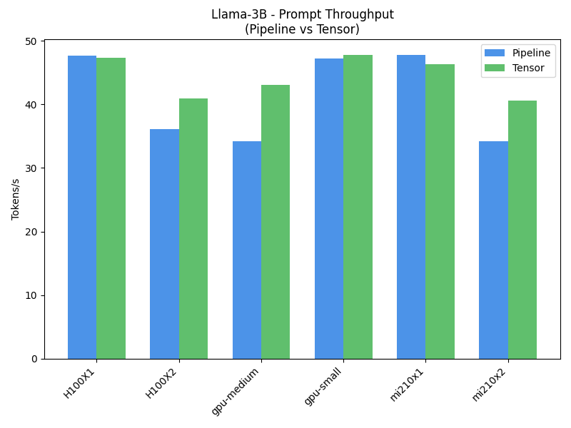<figcaption></figcaption></figure>

<figure>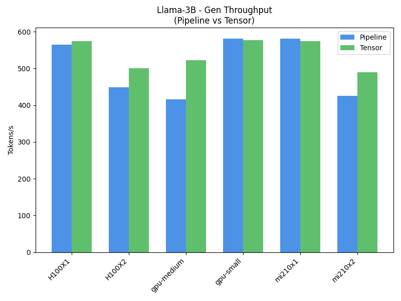<figcaption></figcaption></figure>

**Observations (Llama-3B, 2048 ctx, Pipeline vs. Tensor)**

* **H100X1**: \~-0.6% prompt speedup, \~1.6% gen speedup.
* **H100X2**: \~13.4% prompt speedup, \~11.4% gen speedup.
* **gpu-medium**: \~25.9% prompt speedup, \~25.4% gen speedup.
* **gpu-small**: \~1.2% prompt speedup, \~-0.9% gen speedup.
* **mi210x1**: \~-3.1% prompt speedup, \~-1.1% gen speedup.
* **mi210x2**: \~18.7% prompt speedup, \~14.9% gen speedup.

Overall, we notice that:

* For small models, if they fit on a single GPU, splitting them across multiple GPUs doesn't help. It actually slows down inference.
* The tensor parallel size split is faster than the pipeline parallel size split on multi-gpu setups, which is expected.

### 4. Results & Observations

Below we break down **context length** runs and highlight models performance on specific configurations&#x20;

#### 4.1 2048-Token Context Benchmarks

Below we have three models: **Qwen-1.5B**, **Llama-3B**, **Llama-8B**, and **Qwen-32B**.

**4.1.1 Qwen-1.5B - 2048 context length  @10req at a time for 100 total requests**&#x20;

<table data-full-width="true"><thead><tr><th width="118">Preset</th><th width="130">Prompt TPS</th><th width="115">Gen TPS</th><th width="134">Avg Latency (s)</th><th width="224">Request Generation Level TPS</th><th width="208">Request Prompt Level TPS</th><th>Errors</th></tr></thead><tbody><tr><td>H100X1</td><td>45.74</td><td>649.78</td><td>6.95</td><td>71.64</td><td>5.10</td><td>0</td></tr><tr><td>H100X2</td><td>37.44</td><td>521.10</td><td>8.47</td><td>57.64</td><td>4.33</td><td>0</td></tr><tr><td>gpu-large</td><td>38.09</td><td>535.91</td><td>8.35</td><td>58.93</td><td>4.43</td><td>0</td></tr><tr><td>gpu-medium</td><td>39.73</td><td>552.69</td><td>7.96</td><td>61.43</td><td>4.68</td><td>0</td></tr><tr><td>gpu-small</td><td>46.63</td><td>676.10</td><td>6.79</td><td>74.31</td><td>5.21</td><td>0</td></tr><tr><td>mi210x1</td><td>43.73</td><td>618.48</td><td>7.24</td><td>68.46</td><td>5.06</td><td>0</td></tr><tr><td>mi210x2</td><td>9.35</td><td>125.16</td><td>8.84</td><td>55.09</td><td>4.13</td><td>10</td></tr></tbody></table>

<figure>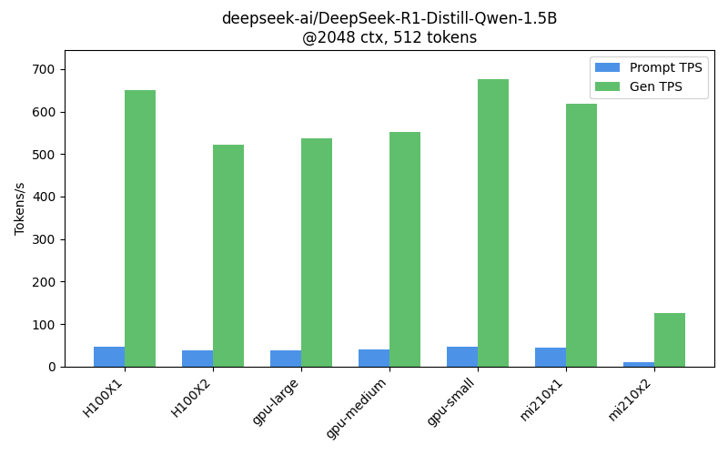<figcaption></figcaption></figure>

**Observations (Qwen-1.5B, 2048 ctx)**:

* Highest **Prompt TPS**: `gpu-small` with 46.63 tokens/s
* Highest **Gen TPS**: `gpu-small` with 676.10 tokens/s
* Notable errors on: mi210x2 (10 errs)

**4.1.2 Llama-3B - 2048 context length  @10req at a time for 100 total requests**&#x20;

<table data-full-width="true"><thead><tr><th width="132">Preset</th><th>Prompt TPS</th><th width="117">Gen TPS</th><th width="141">Avg Latency (s)</th><th width="234">Request Generation Level TPS</th><th width="227">Request Prompt Level TPS</th><th>Errors</th></tr></thead><tbody><tr><td>H100X1</td><td>9.12</td><td>105.12</td><td>7.95</td><td>64.26</td><td>5.36</td><td>10</td></tr><tr><td>H100X2</td><td>40.23</td><td>500.80</td><td>7.83</td><td>55.76</td><td>4.55</td><td>0</td></tr><tr><td>gpu-large</td><td>41.73</td><td>510.79</td><td>7.37</td><td>58.00</td><td>4.84</td><td>0</td></tr><tr><td>gpu-medium</td><td>43.03</td><td>532.96</td><td>7.24</td><td>59.75</td><td>4.91</td><td>0</td></tr><tr><td>gpu-small</td><td>47.22</td><td>576.56</td><td>6.49</td><td>65.87</td><td>5.51</td><td>0</td></tr><tr><td>gpu-xlarge</td><td>42.42</td><td>510.52</td><td>7.31</td><td>57.83</td><td>4.91</td><td>0</td></tr><tr><td>mi210x1</td><td>45.35</td><td>570.08</td><td>6.73</td><td>65.08</td><td>5.31</td><td>0</td></tr><tr><td>mi210x2</td><td>38.17</td><td>475.52</td><td>8.30</td><td>52.58</td><td>4.30</td><td>0</td></tr></tbody></table>

<figure>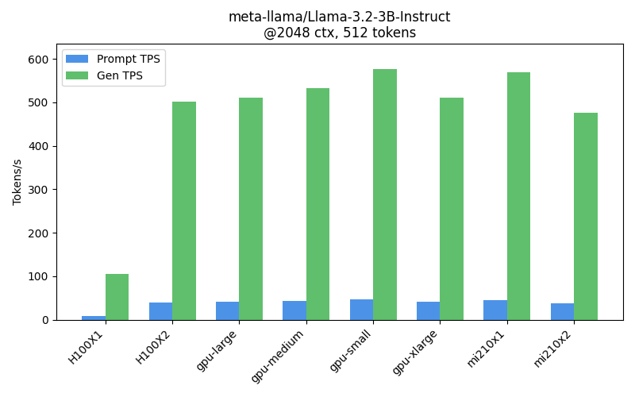<figcaption></figcaption></figure>

**Observations (Llama-3B, 2048 ctx)**

* Highest **Prompt TPS**: `gpu-small` with 47.22 tokens/s
* Highest **Gen TPS**: `gpu-small` with 576.56 tokens/s
* Notable errors on: H100X1 (10 errs)

**4.1.3 Llama-8B - 2048 context length  @10req at a time for 100 total requests**&#x20;

<table data-full-width="true"><thead><tr><th>Preset</th><th>Prompt TPS</th><th>Gen TPS</th><th>Avg Latency (s)</th><th>Request Generation Level TPS</th><th>Request Prompt Level TPS</th><th>Errors</th></tr></thead><tbody><tr><td>H100X1</td><td>28.07</td><td>399.07</td><td>11.60</td><td>42.91</td><td>3.04</td><td>0</td></tr><tr><td>H100X2</td><td>5.08</td><td>66.26</td><td>11.01</td><td>45.72</td><td>3.19</td><td>20</td></tr><tr><td>gpu-large</td><td>34.24</td><td>492.47</td><td>9.52</td><td>52.81</td><td>3.69</td><td>0</td></tr><tr><td>gpu-medium</td><td>34.56</td><td>491.24</td><td>9.17</td><td>54.03</td><td>3.84</td><td>1</td></tr><tr><td>gpu-xlarge</td><td>34.27</td><td>488.51</td><td>9.41</td><td>52.93</td><td>3.75</td><td>0</td></tr><tr><td>mi210x1</td><td>28.09</td><td>407.72</td><td>11.66</td><td>43.22</td><td>3.02</td><td>0</td></tr><tr><td>mi210x2</td><td>31.46</td><td>444.93</td><td>10.17</td><td>48.53</td><td>3.47</td><td>0</td></tr></tbody></table>

<figure>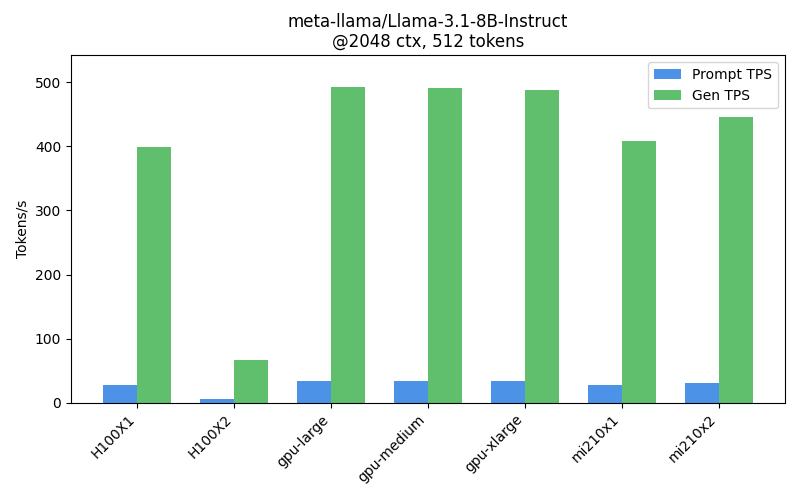<figcaption></figcaption></figure>

**Observations (Llama-8B, 2048 ctx)**:

* Highest **Prompt TPS**: `gpu-medium` with 34.56 tokens/s
* Highest **Gen TPS**: `gpu-large` with 492.47 tokens/s
* Notable errors on: gpu-medium (1 errs), H100X2 (20 errs)

**4.1.4 Qwen-32B - 2048 context length  @10req at a time for 100 total requests**&#x20;

<table data-full-width="true"><thead><tr><th>Preset</th><th>Prompt TPS</th><th>Gen TPS</th><th>Avg Latency (s)</th><th>Request Generation Level TPS</th><th>Request Prompt Level TPS</th><th>Errors</th></tr></thead><tbody><tr><td>H100X1</td><td>14.44</td><td>123.72</td><td>22.27</td><td>13.42</td><td>1.95</td><td>0</td></tr><tr><td>H100X2</td><td>20.39</td><td>175.25</td><td>15.88</td><td>18.87</td><td>2.70</td><td>0</td></tr><tr><td>gpu-xlarge</td><td>8.20</td><td>73.99</td><td>12.06</td><td>27.64</td><td>3.53</td><td>10</td></tr></tbody></table>

<figure>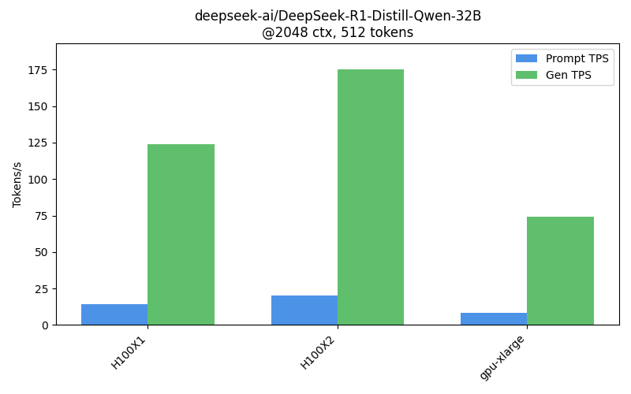<figcaption></figcaption></figure>

**Observations (Qwen-32B, 2048 ctx)**:

* Highest **Prompt TPS**: `H100X2` with 20.39 tokens/s
* Highest **Gen TPS**: `H100X2` with 175.25 tokens/s
* Notable errors on: gpu-xlarge (10 errs)

#### 4.2 8192-Token Context Benchmarks

#### 4.2.1 DeepSeek-R1-Distill-Qwen-1.5B **- 8192 context length  @10req at a time for 100 total requests**

<table data-full-width="true"><thead><tr><th>Preset</th><th>Prompt TPS</th><th>Gen TPS</th><th>Avg Latency (s)</th><th>Request Generation Level TPS</th><th>Request Prompt Level TPS</th><th>Errors</th></tr></thead><tbody><tr><td>H100X1</td><td>23.80</td><td>605.55</td><td>12.79</td><td>69.47</td><td>3.21</td><td>0</td></tr><tr><td>H100X2</td><td>20.07</td><td>517.68</td><td>15.33</td><td>58.55</td><td>2.89</td><td>0</td></tr><tr><td>gpu-large</td><td>20.76</td><td>531.39</td><td>15.24</td><td>58.74</td><td>2.61</td><td>0</td></tr><tr><td>gpu-medium</td><td>22.98</td><td>551.03</td><td>13.77</td><td>61.23</td><td>2.97</td><td>0</td></tr><tr><td>gpu-small</td><td>27.97</td><td>666.18</td><td>11.56</td><td>71.97</td><td>3.87</td><td>0</td></tr><tr><td>mi210x1</td><td>24.30</td><td>602.95</td><td>12.67</td><td>68.55</td><td>3.41</td><td>0</td></tr><tr><td>mi210x2</td><td>19.05</td><td>469.01</td><td>17.02</td><td>50.65</td><td>2.56</td><td>0</td></tr></tbody></table>

<figure>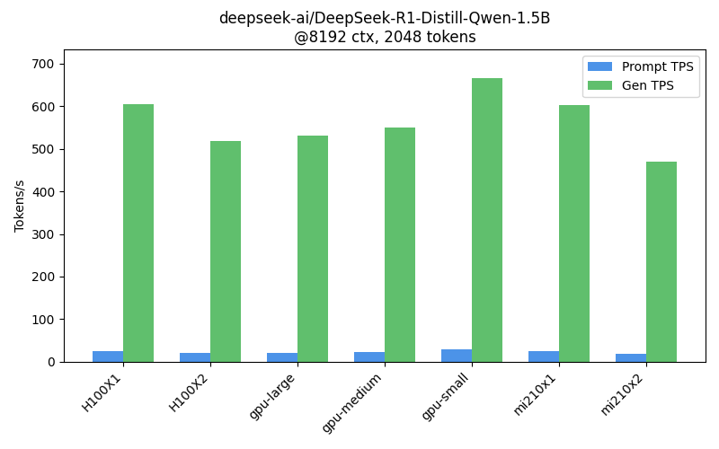<figcaption></figcaption></figure>

**Observations**

* Highest **Prompt TPS**: `gpu-small` with 27.97 tokens/s
* Highest **Gen TPS**: `gpu-small` with 666.18 tokens/s

#### 4.2.2 Llama-3.2-3B-Instruct **- 8192 context length  @10req at a time for 100 total requests**

<table data-full-width="true"><thead><tr><th>Preset</th><th>Prompt TPS</th><th>Gen TPS</th><th>Avg Latency (s)</th><th>Request Generation Level TPS</th><th>Request Prompt Level TPS</th><th>Errors</th></tr></thead><tbody><tr><td>H100X1</td><td>37.67</td><td>522.51</td><td>8.28</td><td>58.67</td><td>4.70</td><td>0</td></tr><tr><td>H100X2</td><td>38.42</td><td>496.42</td><td>8.23</td><td>55.05</td><td>4.63</td><td>0</td></tr><tr><td>gpu-large</td><td>40.86</td><td>523.26</td><td>7.82</td><td>57.39</td><td>4.85</td><td>0</td></tr><tr><td>gpu-medium</td><td>38.88</td><td>531.07</td><td>8.23</td><td>58.16</td><td>4.70</td><td>0</td></tr><tr><td>gpu-small</td><td>38.51</td><td>521.73</td><td>7.22</td><td>65.37</td><td>5.23</td><td>0</td></tr><tr><td>gpu-xlarge</td><td>36.69</td><td>512.53</td><td>8.55</td><td>56.85</td><td>4.64</td><td>0</td></tr><tr><td>mi210x1</td><td>37.78</td><td>545.31</td><td>7.66</td><td>64.91</td><td>5.36</td><td>1</td></tr><tr><td>mi210x2</td><td>29.98</td><td>421.53</td><td>9.11</td><td>53.83</td><td>4.29</td><td>0</td></tr></tbody></table>

<figure>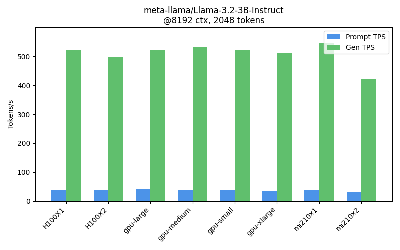<figcaption></figcaption></figure>

**Observations**

* Highest **Prompt TPS**: `gpu-large` with 40.86 tokens/s
* Highest **Gen TPS**: `mi210x1` with 545.31 tokens/s
* Notable errors on: mi210x1 (1 errs)

#### 4.2.3 Llama-8B **- 8192 context length  @10req at a time for 100 total requests**

<table data-full-width="true"><thead><tr><th>Preset</th><th>Prompt TPS</th><th>Gen TPS</th><th>Avg Latency (s)</th><th>Request Generation Level TPS</th><th>Request Prompt Level TPS</th><th>Errors</th></tr></thead><tbody><tr><td>H100X1</td><td>8.27</td><td>369.33</td><td>23.56</td><td>39.56</td><td>2.18</td><td>63</td></tr><tr><td>H100X2</td><td>7.83</td><td>382.46</td><td>26.82</td><td>41.91</td><td>2.05</td><td>64</td></tr><tr><td>gpu-large</td><td>10.82</td><td>493.55</td><td>30.12</td><td>52.87</td><td>1.78</td><td>0</td></tr><tr><td>gpu-medium</td><td>10.18</td><td>503.87</td><td>32.15</td><td>53.54</td><td>1.53</td><td>0</td></tr><tr><td>gpu-xlarge</td><td>10.79</td><td>494.30</td><td>30.44</td><td>52.60</td><td>1.74</td><td>0</td></tr><tr><td>mi210x1</td><td>8.10</td><td>397.21</td><td>40.79</td><td>41.65</td><td>1.25</td><td>0</td></tr><tr><td>mi210x2</td><td>10.57</td><td>455.34</td><td>30.63</td><td>48.88</td><td>1.81</td><td>0</td></tr></tbody></table>

<figure>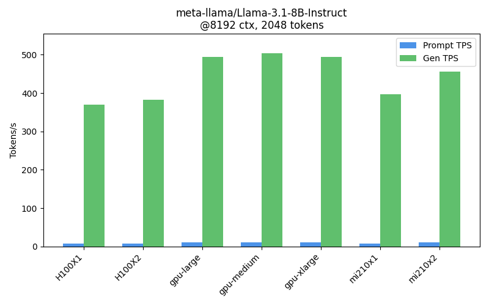<figcaption></figcaption></figure>

**Observations (Llama-8B, 8192 ctx)**

* Highest **Prompt TPS**: `gpu-large` with 10.82 tokens/s
* Highest **Gen TPS**: `gpu-medium` with 503.87 tokens/s
* Notable errors on: H100X1 (63 errs), H100X2 (64 errs)

#### 4.2.4 Qwen-32B  **- 8192 context length  @10req at a time for 100 total requests**

<table data-full-width="true"><thead><tr><th>Preset</th><th>Prompt TPS</th><th>Gen TPS</th><th>Avg Latency (s)</th><th>Request Generation Level TPS</th><th>Request Prompt Level TPS</th><th>Errors</th></tr></thead><tbody><tr><td>H100X1</td><td>11.49</td><td>116.34</td><td>22.60</td><td>13.39</td><td>1.91</td><td>14</td></tr><tr><td>H100X2</td><td>17.82</td><td>160.93</td><td>16.17</td><td>18.63</td><td>2.89</td><td>2</td></tr><tr><td>gpu-xlarge</td><td>25.81</td><td>229.41</td><td>11.28</td><td>27.48</td><td>3.97</td><td>0</td></tr></tbody></table>

<figure>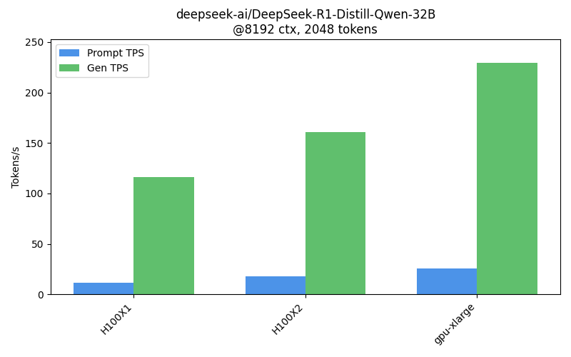<figcaption></figcaption></figure>

**Observations**

* Highest **Prompt TPS**: `gpu-xlarge` with 25.81 tokens/s
* Highest **Gen TPS**: `gpu-xlarge` with 229.41 tokens/s
* Notable errors on: H100X1 (14 errs), H100X2 (2 errs)

#### 4.3 64k-Token Context Benchmarks

#### 4.3.1 Qwen-1.5B **-** 64k **context length  @10req at a time for 100 total requests**

<table data-full-width="true"><thead><tr><th>Preset</th><th>Prompt TPS</th><th>Gen TPS</th><th>Avg Latency (s)</th><th>Request Generation Level TPS</th><th>Request Prompt Level TPS</th><th>Errors</th></tr></thead><tbody><tr><td>H100X1</td><td>24.50</td><td>621.06</td><td>13.04</td><td>68.12</td><td>3.35</td><td>0</td></tr><tr><td>H100X2</td><td>7.58</td><td>181.16</td><td>14.96</td><td>57.85</td><td>2.85</td><td>10</td></tr><tr><td>mi210x1</td><td>24.49</td><td>609.78</td><td>12.68</td><td>68.15</td><td>3.29</td><td>0</td></tr><tr><td>mi210x2</td><td>18.45</td><td>502.88</td><td>17.12</td><td>54.94</td><td>2.48</td><td>0</td></tr></tbody></table>

<figure>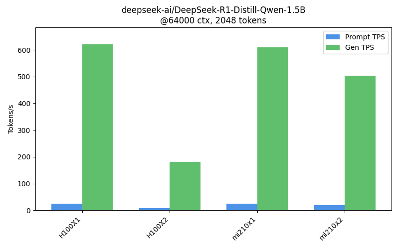<figcaption></figcaption></figure>

**Observations**

* Highest **Prompt TPS**: `H100X1` with 24.50 tokens/s
* Highest **Gen TPS**: `H100X1` with 621.06 tokens/s
* Notable errors on: H100X2 (10 errs)

#### 4.3.2 Llama-3.2-3B **-** 64k **context length  @10req at a time for 100 total requests**

<table data-full-width="true"><thead><tr><th>Preset</th><th>Prompt TPS</th><th>Gen TPS</th><th>Avg Latency (s)</th><th>Request Generation Level TPS</th><th>Request Prompt Level TPS</th><th>Errors</th></tr></thead><tbody><tr><td>H100X1</td><td>45.85</td><td>570.00</td><td>6.74</td><td>64.60</td><td>5.40</td><td>0</td></tr><tr><td>H100X2</td><td>40.34</td><td>501.89</td><td>7.80</td><td>55.93</td><td>4.71</td><td>0</td></tr><tr><td>mi210x1</td><td>40.51</td><td>595.07</td><td>7.85</td><td>65.21</td><td>5.22</td><td>0</td></tr><tr><td>mi210x2</td><td>30.43</td><td>419.55</td><td>9.04</td><td>53.19</td><td>4.30</td><td>0</td></tr></tbody></table>

<figure>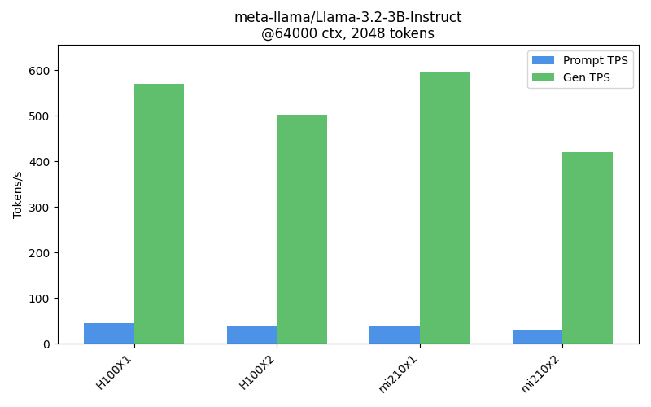<figcaption></figcaption></figure>

**Observations**

* Highest **Prompt TPS**: `H100X1` with 45.85 tokens/s
* Highest **Gen TPS**: `mi210x1` with 595.07 tokens/s

#### 4.3.3 Llama-3.1-8B **-** 64k **context length  @10req at a time for 100 total requests**

<table data-full-width="true"><thead><tr><th>Preset</th><th>Prompt TPS</th><th>Gen TPS</th><th>Avg Latency (s)</th><th>Request Generation Level TPS</th><th>Request Prompt Level TPS</th><th>Errors</th></tr></thead><tbody><tr><td>H100X1</td><td>8.35</td><td>367.05</td><td>19.59</td><td>39.50</td><td>2.53</td><td>65</td></tr><tr><td>H100X2</td><td>8.09</td><td>386.26</td><td>34.04</td><td>41.59</td><td>1.64</td><td>41</td></tr><tr><td>mi210x2</td><td>8.65</td><td>451.61</td><td>38.24</td><td>47.71</td><td>1.26</td><td>0</td></tr></tbody></table>

<figure>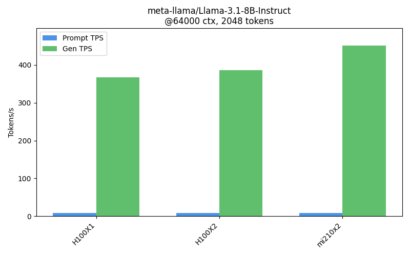<figcaption></figcaption></figure>

**Observations**

* Highest **Prompt TPS**: `mi210x2` with 8.65 tokens/s
* Highest **Gen TPS**: `mi210x2` with 451.61 tokens/s
* Notable errors on: H100X1 (65 errs), H100X2 (41 errs)

#### 4.3.4 DeepSeek-R1-Distill-Qwen-32B **-** 64k **context length  @10req at a time for 100 total requests**

<table data-full-width="true"><thead><tr><th>Preset</th><th>Prompt TPS</th><th>Gen TPS</th><th>Avg Latency (s)</th><th>Request Generation Level TPS</th><th>Request Prompt Level TPS</th><th>Errors</th></tr></thead><tbody><tr><td>H100X2</td><td>19.32</td><td>176.10</td><td>15.99</td><td>19.06</td><td>2.91</td><td>2</td></tr></tbody></table>

<figure>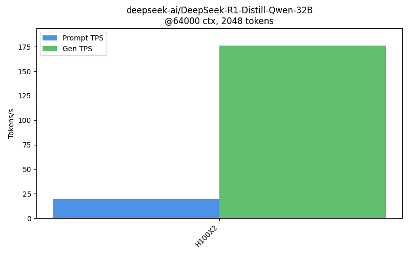<figcaption></figcaption></figure>

**Observations**

* Highest **Prompt TPS**: `H100X2` with 19.32 tokens/s
* Highest **Gen TPS**: `H100X2` with 176.10 tokens/s
* Notable errors on: H100X2 (2 errs)

#### 4.4 128k-Token Context Benchmarks

#### 4.4.1 Qwen-1.5B **- 128k context length  @10req at a time for 100 total requests**

<table data-full-width="true"><thead><tr><th>Preset</th><th>Prompt TPS</th><th>Gen TPS</th><th>Avg Latency (s)</th><th>Request Generation Level TPS</th><th>Request Prompt Level TPS</th><th>Errors</th></tr></thead><tbody><tr><td>H100X1</td><td>26.45</td><td>642.54</td><td>11.98</td><td>70.88</td><td>3.45</td><td>0</td></tr><tr><td>H100X2</td><td>21.76</td><td>536.27</td><td>14.77</td><td>58.37</td><td>2.87</td><td>0</td></tr><tr><td>mi210x1</td><td>24.13</td><td>618.17</td><td>13.10</td><td>68.26</td><td>3.22</td><td>0</td></tr><tr><td>mi210x2</td><td>17.80</td><td>494.41</td><td>17.49</td><td>54.64</td><td>2.40</td><td>0</td></tr></tbody></table>

<figure>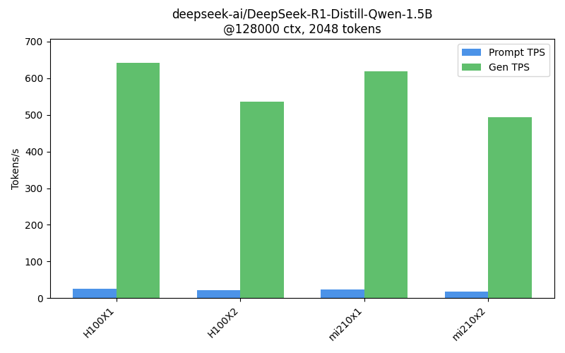<figcaption></figcaption></figure>

**Observations**

* Highest **Prompt TPS**: `H100X1` with 26.45 tokens/s
* Highest **Gen TPS**: `H100X1` with 642.54 tokens/s

#### 4.4.2 Llama-3.2-3B **- 128k context length  @10req at a time for 100 total requests**

<table data-full-width="true"><thead><tr><th>Preset</th><th>Prompt TPS</th><th>Gen TPS</th><th>Avg Latency (s)</th><th>Request Generation Level TPS</th><th>Request Prompt Level TPS</th><th>Errors</th></tr></thead><tbody><tr><td>H100X1</td><td>45.53</td><td>574.22</td><td>6.84</td><td>64.60</td><td>5.30</td><td>0</td></tr><tr><td>H100X2</td><td>30.05</td><td>451.14</td><td>9.50</td><td>55.15</td><td>4.41</td><td>0</td></tr><tr><td>mi210x1</td><td>44.17</td><td>574.07</td><td>7.08</td><td>64.16</td><td>5.30</td><td>0</td></tr><tr><td>mi210x2</td><td>32.06</td><td>444.00</td><td>9.42</td><td>51.15</td><td>4.19</td><td>0</td></tr></tbody></table>

<figure>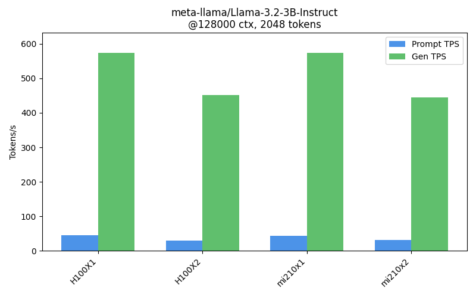<figcaption></figcaption></figure>

**Observations**

* Highest **Prompt TPS**: `H100X1` with 45.53 tokens/s
* Highest **Gen TPS**: `H100X1` with 574.22 tokens/s

#### 4.4.3 Llama-3.1-8B **- 128k context length  @10req at a time for 100 total requests**

<table data-full-width="true"><thead><tr><th>Preset</th><th>Prompt TPS</th><th>Gen TPS</th><th>Avg Latency (s)</th><th>Request Generation Level TPS</th><th>Request Prompt Level TPS</th><th>Errors</th></tr></thead><tbody><tr><td>H100X1</td><td>7.10</td><td>360.40</td><td>27.75</td><td>40.10</td><td>2.00</td><td>80</td></tr><tr><td>H100X2</td><td>8.38</td><td>381.71</td><td>28.39</td><td>41.35</td><td>1.95</td><td>49</td></tr><tr><td>mi210x2</td><td>10.08</td><td>467.43</td><td>32.70</td><td>49.46</td><td>1.62</td><td>0</td></tr></tbody></table>

<figure>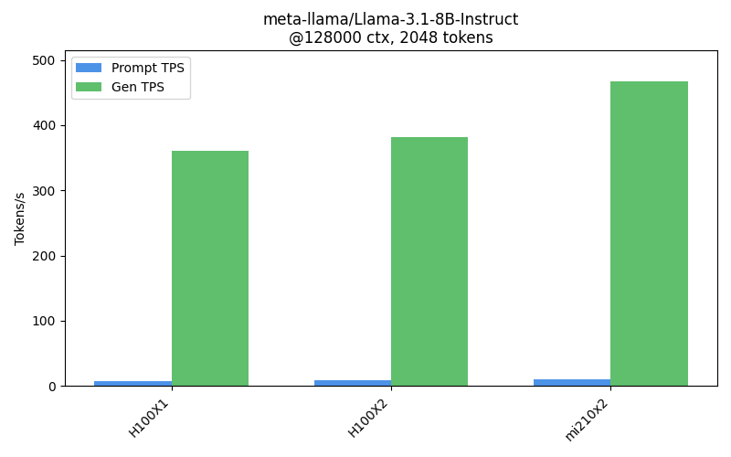<figcaption></figcaption></figure>

**Observations**

* Highest **Prompt TPS**: `mi210x2` with 10.08 tokens/s
* Highest **Gen TPS**: `mi210x2` with 467.43 tokens/s
* Notable errors on: H100X1 (80 errs), H100X2 (49 errs)

#### 4.4.4 DeepSeek-R1-Distill-Qwen-32B **- 128k context length  @10req at a time for 100 total requests**

<table data-full-width="true"><thead><tr><th>Preset</th><th>Prompt TPS</th><th>Gen TPS</th><th>Avg Latency (s)</th><th>Request Generation Level TPS</th><th>Request Prompt Level TPS</th><th>Errors</th></tr></thead><tbody><tr><td>H100X2</td><td>18.96</td><td>168.05</td><td>16.02</td><td>18.98</td><td>2.90</td><td>1</td></tr></tbody></table>

<figure>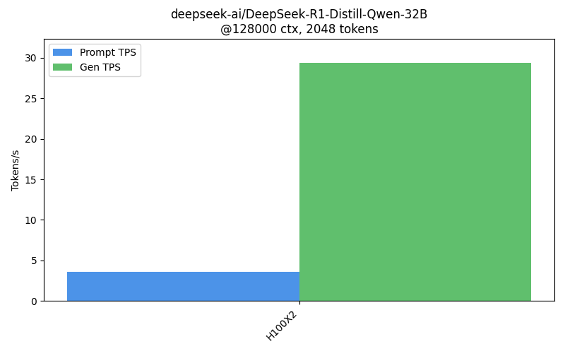<figcaption></figcaption></figure>

**Observations**

* Highest **Prompt TPS**: `H100X2` with 18.96 tokens/s
* Highest **Gen TPS**: `H100X2` with 168.05 tokens/s
* Notable errors on: H100X2 (1 errs)

### 5. Overview of concurrency strategies

Concurrency significantly impacts overall system throughput. You will observe that the request-level tokens per second (TPS) decreases as concurrency rises, while the total system throughput increases due to the vLLMs Paged Attention algorithm and other enhancements. This aspect can be adjusted for various trade-offs to boost system throughput, accommodate a reasonable number of request level tokens per second, and reduce errors.

<table data-full-width="true"><thead><tr><th width="120">Preset</th><th>Prompt TPS</th><th>Gen TPS</th><th width="144">Avg Latency (s)</th><th width="237">Request Generation Level TPS</th><th width="210">Request Prompt Level TPS</th><th width="114" data-type="number">Concurrency</th><th>Errors</th></tr></thead><tbody><tr><td>H100X2</td><td>18.96</td><td>168.05</td><td>16.02</td><td>18.98</td><td>2.90</td><td>10</td><td>1</td></tr><tr><td>H100X2</td><td>3.62</td><td>29.36</td><td>10.2027</td><td>29.45</td><td>3.62</td><td>1</td><td>0</td></tr></tbody></table>

<figure><figcaption>
Concurrency of 10req at a time
</figcaption></figure>

<figure><figcaption>
Concurrency of 1req at a time
</figcaption></figure>

### **Important notes**

1. The script uses a short, fixed prompt, which can lead to high generation throughput.
2. It employs sequential concurrent requests, maximizing GPU utilization.
3. The powerful hardware capabilities align with these performance figures.
4. You can squeeze a lot more from these presets with multiple model instances on same GPUs.

