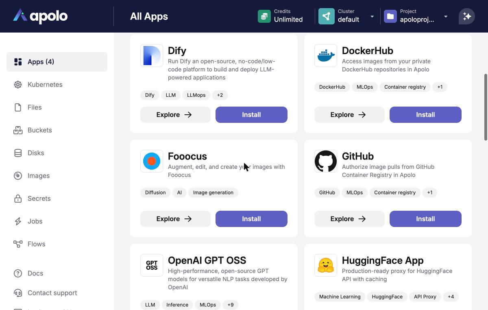
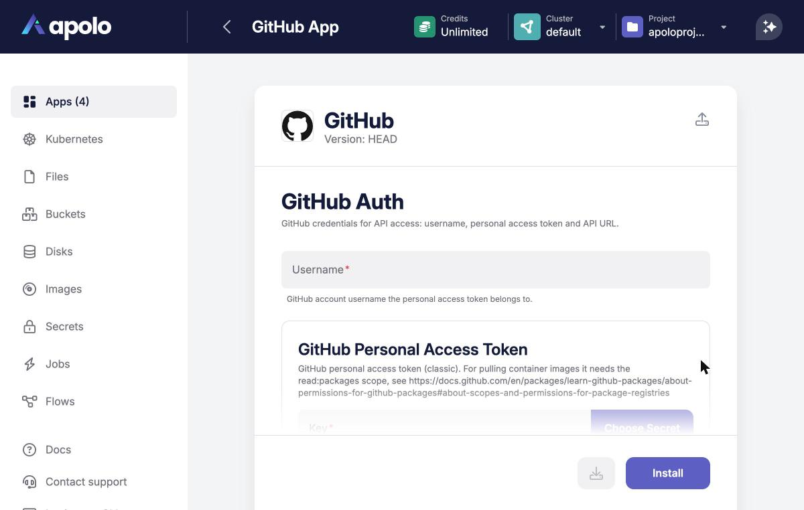
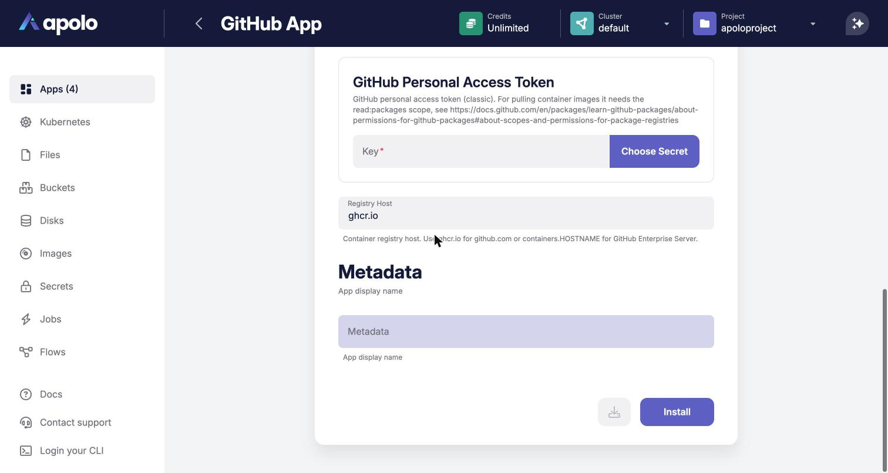
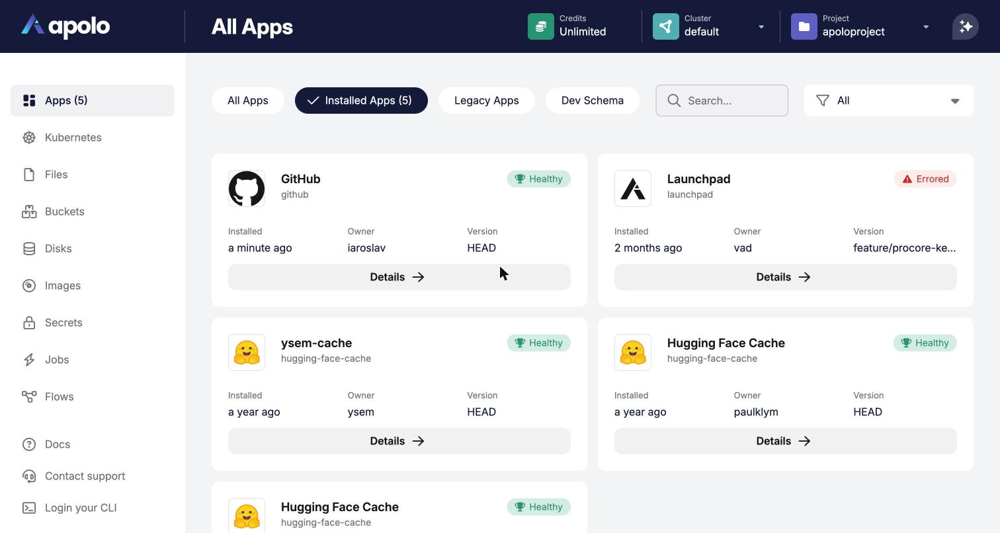

# GitHub

## Overview

The **GitHub** application connects your GitHub account to Apolo using a personal access token (PAT). Once installed, it exposes two integrations that other applications can consume:

* **GitHub Container Registry Auth** — credentials for pulling container images from the GitHub Container Registry (`ghcr.io`, or your GitHub Enterprise Server registry host). Wire it into [Service Deployment](service-deployment.md) or other apps to run images from your private GitHub repositories without manually managing docker config secrets.
* **GitHub Auth** — generic GitHub API credentials (username, token and API URL) for applications that need to talk to the GitHub API.

The application is deployment-less: it does not run any workloads and becomes healthy immediately after installation. Your token is stored as an [Apolo secret](../../pre-installed/secrets.md) and is only referenced — never copied — by the integrations.

## Prerequisites

1. A GitHub personal access token (classic). For pulling container images it needs the `read:packages` scope — see [About permissions for GitHub Packages](https://docs.github.com/en/packages/learn-github-packages/about-permissions-for-github-packages#about-scopes-and-permissions-for-package-registries).
2. The token stored as an Apolo secret in the **same cluster, organization and project** where the consuming applications will be installed, e.g.:

```bash
apolo secret add github-pat <your-token>
```

## Installing

### Installing with Apolo Console

1. Access the Apolo Console, go to the **Apps** section and select the **GitHub** application.

<figure><figcaption><p>GitHub application in the apps catalog</p></figcaption></figure>
2. Configure the two credential groups:

* **GitHub Auth**
  * **Username** — the GitHub account the token belongs to.
  * **GitHub Personal Access Token** — pick the Apolo secret holding the PAT.
  * **API URL** — leave the default `https://api.github.com`, or set your GitHub Enterprise Server API endpoint.
* **GitHub Container Registry Auth**
  * **Registry Host** — leave the default `ghcr.io` for github.com; for GitHub Enterprise Server use `containers.HOSTNAME`.
  * **Username** and **GitHub Personal Access Token** — same as above.

<figure><figcaption><p>GitHub Auth configuration</p></figcaption></figure>

<figure><figcaption><p>Personal access token and registry host</p></figcaption></figure>

3. Set the application display name and install. The app becomes **healthy** right away — there is nothing to deploy.

<figure><figcaption><p>Installed GitHub app</p></figcaption></figure>

### Installing with Apolo CLI

Save the configuration to a YAML file:

```yaml
template_name: github
template_version: HEAD
input:
  auth:
    username: <github-username>
    token:
      key: github-pat
    api_url: https://api.github.com
  image_registry_auth:
    registry_url: ghcr.io
    username: <github-username>
    token:
      key: github-pat
```

and install it:

```bash
apolo app install -f github-app.yaml
```

## Usage

After installation the app exposes its integrations as outputs:

```bash
apolo app get-values <app-instance-id>
```

| Path | Type | Purpose |
| --- | --- | --- |
| `$.image_registry_auth` | `GithubImageRegistryAuth` | Image pull credentials for `ghcr.io` / GHES registries |
| `$.auth` | `GithubAuth` | GitHub API credentials |

Consuming applications reference them either through the integration picker in the Console, or in a CLI install file via an app instance reference:

```yaml
imagepullsecret:
  type: "app-instance-ref"
  instance_id: "<github-app-instance-id>"
  path: "$.image_registry_auth"
```

See [Service Deployment](service-deployment.md#pulling-images-from-private-registries) for a complete example.

#### Notes

* The PAT secret is resolved in the consuming application's cluster, organization and project — install the GitHub app and its consumers in the same project.
* Registry credentials are rendered into the deployment at install time; after rotating the token in the Apolo secret, redeploy the consuming applications to pick up the new value.
