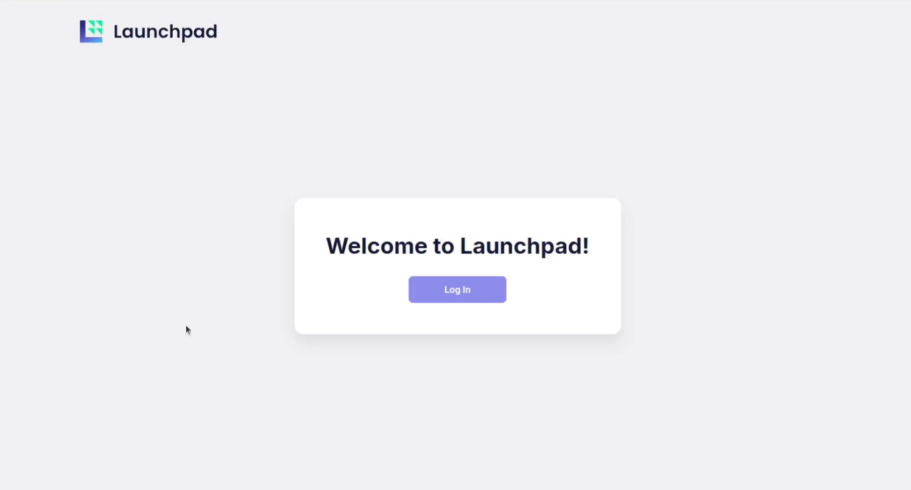

# Launchpad

**Launchpad** is an application gateway for the Apolo MLOps platform that enables Apolo users to securely expose platform applications to end-users through customizable authentication powered by Keycloak integration.

With Launchpad, you can share access to applications deployed on Apolo—including pre-built apps like OpenWebUI (a user-friendly interface for interacting with LLMs)—without requiring end-users to have full Apolo accounts. Additionally, Launchpad allows you to deploy custom applications using Apolo's Service Deployment feature and expose them to your users with personalized branding, including custom names, descriptions, and logos.

**Key capabilities include:**

* **Bring Your Own Authentication:** Deploy and manage a dedicated Keycloak instance for user authentication, with support for user management, role-based access control, groups, and integration with external identity providers (OIDC, OAuth2)
* **Flexible App Deployment Models:**
  * **Shared Applications:** Deploy a single app instance accessible to all users, with the application leveraging user identity information provided by Keycloak (ideal for apps like OpenWebUI that support multi-user collaboration)
  * **Per-User Applications:** Automatically provision isolated app instances for each user, ensuring complete data separation and personalized environments
* **Custom Branding:** Import custom applications or existing app instances with tailored metadata—display names, descriptions, and visual identities—to create a polished experience for your end-users
* **Flexible App Exposure:** Share both platform-native Apolo applications and custom-deployed services through a unified, user-friendly interface
* **Quickstart Presets:** Deploy pre-configured application stacks like OpenWebUI with all dependencies in minutes
* **External User Access:** Provide seamless application access to clients, stakeholders, or team members outside your Apolo organization through Keycloak-managed authentication

***

### 1. Installing Launchpad

Launchpad can be installed from the Apolo Console interface or using the Apolo CLI.

#### 1.1 Installation via Apolo Console

1. **Navigate to the Apps page** in the Apolo Console.
2. **Find the Launchpad App** and click **Install**.
3. **Configure Launchpad Preset:**
   * Choose a suitable **Resource Preset** for the Launchpad application itself (e.g., `cpu-medium` or higher).
4. **Choose Quickstart Apps:**
   * **No Startup Apps:** Installs only Launchpad, allowing you to add applications later.
   * **OpenWebUI:** Installs OpenWebUI and its dependencies upon Launchpad startup, providing a pre-configured LLM chat interface.

**OpenWebUI Configuration (Optional)**

If you select the **OpenWebUI**, you need to configure the following dependencies:

* **LLM Configuration:**
  * **Pre-configured HuggingFace LLM Model:** Select the desired LLM model (e.g., `meta-llama/Llama-3.1-8B-Instruct`).
  * **Hugging Face Token (Optional):** If using gated or private models, provide a Hugging Face API token stored as an Apolo Secret (`HF_TOKEN`).
  * **LLM Preset:** Choose a resource preset for the LLM model (typically a GPU-enabled preset, e.g., `gpu-a100-x1`).
* **Postgres Configuration:**
  * **Postgres Preset:** Choose a resource preset for the Postgres database (e.g., `cpu-medium`).
  * **Postgres Replicas:** Set the number of replicas (e.g., `1`).
* **Text Embeddings Configuration:**
  * **Text Embeddings Preset:** Choose a resource preset for the embeddings service (e.g., `gpu-l4-x1`).
  * **Embeddings Model:** Select a pre-configured Hugging Face model for text embeddings (e.g., `BAAI/bge-m3`).

5. **Metadata (Optional):** You can customize the app display name.
6. **Click Install.**

Be aware that when choosing the OpenWebUI Quick Start App option, Apolo will also install vLLM, Text Embeddings and Postgresql apps, which will consume credits as well.

#### 1.2 Installation via Apolo CLI (If using OpenWebUI Quick Start App)

Currently, due to a known bug in the UI, if you choose the OpenWebUI Quick Start App, it's recommended to export the configuration and install it using the Apolo CLI:

1. **In the Launchpad App installation page**, select the **OpenWebUI** Quick Start App and configure your options.
2. Scroll to the bottom and click **Export App Configuration** (download icon).
3. Open your terminal and install the app using the downloaded configuration file:

```bash
apolo app install --file launchpad-custom-app-installation-config.yaml
```

***

### 2. Managing Launchpad and Keycloak Users

Once Launchpad is installed, you can access the installed app on the **Installed Apps** page. Click **Open** to access various Launchpad URLs.

#### 2.1 Accessing the Launchpad Interface

1. Click **Open** on the Launchpad app card.
2. Select **App URL**.
3.  The Launchpad interface loads, requiring a login.\


    <figure><figcaption></figcaption></figure>


4.  Launchpad comes with a default admin user that can manage what apps are available through Launchpad UI. You can find this admin user's credentials by scrolling down the Launchpad instance details page in Apolo and copying the **Password** field in **Launchpad Default Admin User**\


    <figure><figcaption></figcaption></figure>
5.  Use these credentials to login to Launchpad. You should see a list of available apps - only OpenWebUI for now\
    &#x20;

    <figure><figcaption></figcaption></figure>

#### 2.2 Managing Users via Keycloak

Launchpad uses Keycloak for authentication and user management.

1. **Access Keycloak:**
   * On the Launchpad app card (in Apolo), click **Open**.
   * Select **Keycloak Config > Web App URL**.
2. **Retrieve Admin Credentials:**
   * Go to the **Launchpad Details** page in the Apolo Console.
   * Under the **Output** section, find **Launchpad Default Admin User** to retrieve the default username (`admin`) and **Password**.
   * Scroll down to **KeycloakConfig** to find the **Keycloak Admin Password** (used for the Keycloak administrative interface).
3. **Log into Keycloak:**
   * Use the Keycloak Admin Password and the username `admin` to sign in to the Keycloak Administration page.
4. **Manage Users and Groups:**
   * **Add User:** Navigate to **Users** and click **Add user** to create new users.
   * **Manage Roles and Groups:** Navigate to **Groups** to create groups and assign roles/permissions to users.
5. **Enable New Sign-Ups (for OpenWebUI):**
   * If you deployed OpenWebUI, ensure users can sign up:
     * Navigate to **OpenWebUI** in the Installed Apps list.
     * Open the **Admin Panel** (available to the admin user).
     * Go to **Settings > Authentication**.
     * Toggle **Enable New Sign Ups** to `On`.
     * **Save** settings.

***

### 3. Deploying and Sharing Applications

Launchpad allows you to share applications with external users, even those without an Apolo account, by managing authentication through Keycloak.

#### 3.1 Obtaining and Preparing App Templates for Launchpad

Before importing a custom application template into Launchpad using the API, you must first obtain the application's configuration file from the Apolo Console and convert it to the required JSON format.

#### Downloading the App Configuration File

This process generates a YAML configuration file based on the app's standard installation page, pre-filled with the Launchpad authentication settings.

1. **Navigate to the App Installation Page:** In the Apolo Console, go to the **All Apps** page and select the application you wish to import (e.g., **Visual Studio Code**). Click **Install**.
2. **Configure Resource Presets:** Select the necessary resource presets for the application.
3. **Configure Authentication:** Scroll down to the **Networking Settings** section and configure the HTTP Ingress:
   * Change the **Authentication** dropdown to **Custom Authentication**.
   * In the **Custom Authentication** section, click **Choose App** next to the `AuthIngressMiddleware` to integrate Launchpad.
   * Select the installed `Launchpad` instance and click **Apply**.
4.  **Download Configuration:** Scroll to the bottom of the installation page. Click the **Export App Configuration** download icon (a down arrow pointing into a cloud or similar icon, typically next to the "Install" button) to download the `.yaml` configuration file.\
    \
    The following yaml file is an example Downloaded from the VSCode App installation page.\


    ```yaml
    display_name: ""
    template_name: vscode
    template_version: v25.10.1
    input:
        vscode_specific:
            override_code_storage_mount: null
        extra_storage_mounts: null
        mlflow_integration: null
        preset:
            name: cpu-small
        networking:
            ingress_http:
                auth: {
                    middleware: {
                        type: app-instance-ref, 
                        instance_id: "<launchpad-app-instance-id>", 
                        path: $.auth_middleware
                    }, 
                    type: custom_auth
                }

    ```

#### Converting the YAML Configuration to JSON

The Launchpad API requires the app configuration payload to be in JSON format. Use a command-line tool like `yq` or a combination of `cat` and `python` to perform this conversion.

**Method A: Using `python`**

If you don't have `yq`, you can use Python's built-in YAML and JSON libraries:

1.  **Install PyYAML:** If you haven't already, install the necessary library:

    ```bash
    pip install PyYAML
    ```
2.  **Run the Conversion Script:**

    ```bash
    # Replace [FILE_NAME] with the name of your downloaded YAML file
    python -c "import yaml, json, sys; d=yaml.safe_load(sys.stdin.read()); print(json.dumps(d))" < [FILE_NAME].yaml
    ```

**Method B: Using `yq`**&#x20;

If you have `yq` [installed](https://github.com/mikefarah/yq), this is the simplest method:

```bash
# Replace [FILE_NAME] with the name of your downloaded YAML file
cat [FILE_NAME].yaml | yq -o json
```

The output will be the single-line JSON string containing the app template data, which is ready to be used in the API call to import the template into Launchpad.

Here is the resulting json file.

```json
{
  "display_name": "",
  "template_name": "vscode",
  "template_version": "v25.10.1",
  "input": {
    "vscode_specific": {
      "override_code_storage_mount": null
    },
    "extra_storage_mounts": null,
    "mlflow_integration": null,
    "preset": {
      "name": "cpu-small"
    },
    "networking": {
      "ingress_http": {
        "auth": {
          "middleware": {
            "type": "app-instance-ref",
            "instance_id": "<launchpad-app-instance-id>",
            "path": "$.auth_middleware"
          },
          "type": "custom_auth"
        }
      }
    }
  }
}

```

#### 3.1 Importing a Custom App Template

You can import a custom app template into Launchpad. This allows you to define configurations and metadata for an application that can be installed later via Launchpad. Notice how

1.  **Prepare Template Data:** Define the template details in a JSON payload:\
    \
    Notice the new fields `is_internal` , `is_shared` and the renaming of `inputs` to  `default_inputs`

    ```json
    {
      "template_name": "vscodes",
      "template_version": "v25.10.1",
      "name": "vscode-dev",
      "verbose_name": "VS Code Development Environment",
      "description_short": "Cloud-based VS Code IDE",
      "is_internal": false,
      "is_shared": false,
      "default_inputs": {
        "preset": {
          "name": "cpu-medium"
        },
        "vscode_specific": {
          "override_code_storage_mount": null
        },
        "networking": {
          "ingress_http": {
            "auth": {
              "type": "custom_auth",
              "middleware": {
                "type": "app-instance-ref",
                "instance_id": "<launchpad-app-instance-id>",
                "path": "$.auth_middleware"
              }
            }
          }
        }
      }
    }
    ```
2.  **Import the Template (via API):**

    * Use the Launchpad API `apps/templates/import` endpoint with your template data:

    ```bash
    curl -X POST "${LAUNCHPAD_URL}/api/v1/apps/templates/import" \
    -H "Authorization: Bearer $ACCESS_TOKEN" \
    -H "Content-Type: application/json" \
    -d '[YOUR_TEMPLATE_JSON]'
    ```
3. **Deploy from Launchpad:**
   *   The new app template will now be visible in the Launchpad interface, ready for users to install and run their own instance.\
       \


       <figure><figcaption></figcaption></figure>

#### 3.2 Sharing a Deployed Application (Custom Deployment Example)

In this example, we will import an already running `Service Deployment` app into Launchpad and assign Launchpad authentication.

1. **Deploy the App:** Install the **Service Deployment** app in Apolo.
   * Choose a **Resource Preset** (e.g., `cpu-small`).
   * **Container Image:** Provide a container image (e.g., `nginx`).
   * **Storage Mounts:** Optionally mount a storage path (e.g., mounting `storage:///default/apolo/demo/demos` to `/usr/share/nginx/html`).
   * **Network Configuration:**
     * Enable **HTTP Ingress**.
     * Change **Authentication** to **Custom Authentication**.
     * In **Authentication Middleware**, click **Choose App** and select **Launchpad** with the path `$.auth_middleware`.
     * **Install** the application.
2. **Access App ID:** Once installed, go to the Service Deployment app details and copy its **ID**.
3.  **Import App into Launchpad (via API):**

    * **Get Launchpad Access Token:** Use the Launchpad API to get an access token for the `admin` user. You can use the helper script provided in the Launchpad README:

    ```bash
    LAUNCHPAD_URL="https://[YOUR_LAUNCHPAD_URL]"
    LAUNCHPAD_USERNAME="admin"
    LAUNCHPAD_PASSWORD="[YOUR_PASSWORD]"
    SCOPE="openid profile email offline_access"

    TOKEN_RESPONSE=$(curl -s -X POST "${LAUNCHPAD_URL}/auth/token" \
    -H "Content-Type: application/json" \
    -d '{"username":"'${LAUNCHPAD_USERNAME}'","password":"'${LAUNCHPAD_PASSWORD}'","scope":"'${SCOPE}'"}'")

    ACCESS_TOKEN=$(echo "$TOKEN_RESPONSE" | jq -r '.access_token')
    REFRESH_TOKEN=$(echo "$TOKEN_RESPONSE" | jq -r '.refresh_token')

    # Run the curl command to get the ACCESS_TOKEN
    echo $ACCESS_TOKEN
    ```

    * **Import the Application:** Use the Launchpad API `apps/import` endpoint, replacing placeholders with your app's details and the previously obtained `ACCESS_TOKEN`.

    ```bash
    curl -X POST "${LAUNCHPAD_URL}/api/v1/apps/import" \
    -H "Authorization: Bearer $ACCESS_TOKEN" \
    -H "Content-Type: application/json" \
    -d '{
      "app_id": "86441713-dbd1-4d94-ac4c-1b61edc3e2e7",
      "name": "custom-app",
      "verbose_name": "Custom App",
      "description_short": "An externally installed app",
      "is_internal": false
    }'
    ```

    * _Note:_ `is_internal: false` ensures the app is visible to end-users.
4. **Verify and Access in Launchpad:**
   * Go back to the **Launchpad App URL** in your browser.
   * The new **Custom App** card should now be displayed, available for external users to access through Keycloak login.\
     \
     .png>)

***

### Summary

The Launchpad app transforms the Apolo MLOps platform into a user-friendly deployment environment, simplifying application access and user authentication for internal and external users via Keycloak integration. By enabling the import of custom app templates and existing app instances, Launchpad offers a versatile solution for showcasing and managing applications within your ecosystem.

### References

* [Keycloak documentation](https://www.keycloak.org/documentation)
* [OpenWebUI app documentation](openwebui.md)
* [Managing Apps](../../../../apolo-concepts-cli/apps/)
