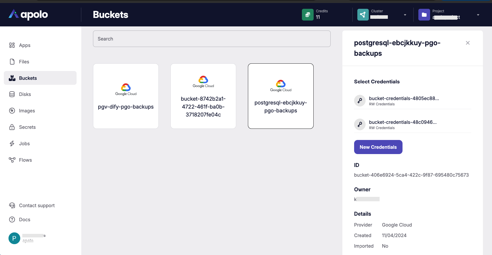
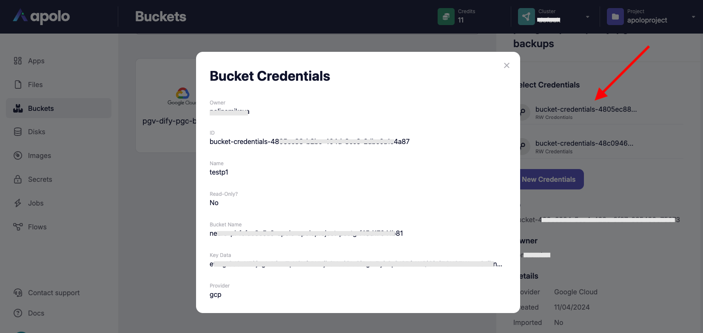

# Buckets

## Overview

The Buckets application in the Apolo Console provides a user interface for managing cloud storage buckets within a specific project and cluster. Buckets can be used to store and organize large amounts of data, such as backups, application data, and other persistent resources, across cloud providers.

This application is accessible from the left-side navigation menu in the Apolo Console. The buckets page displays all storage buckets associated with the selected project and cluster, provides details about each bucket, and offers the option to manage credentials.

## Bucket credentials

For each bucket you can create its own provider-specific credentials with the specific role _Read-Only_ or _Read & Write_. For AWS or MinIO providers those will be secret key ID and access key values, for GCP it will be a JSON key file, etc.

The web console interface provides the ability to create several credentials with different roles and to review details for previously created.

For other operations like uploading and downloading objects, bucket size, creating signed URLs for the objects, importing pre-existing buckets and many more, please refer to the Apolo CLI reference.

For data migration you could also refer Apolo Extras package usage. For extreme amounts of data, please reach us [support@apolo.us](mailto:support@apolo.us).

## References

* [Apolo CLI Buckets reference](https://app.gitbook.com/s/-MOkWy7dB5MDbkSII8iF/commands/blob)
* [Apolo Extras data operations](broken-reference)
