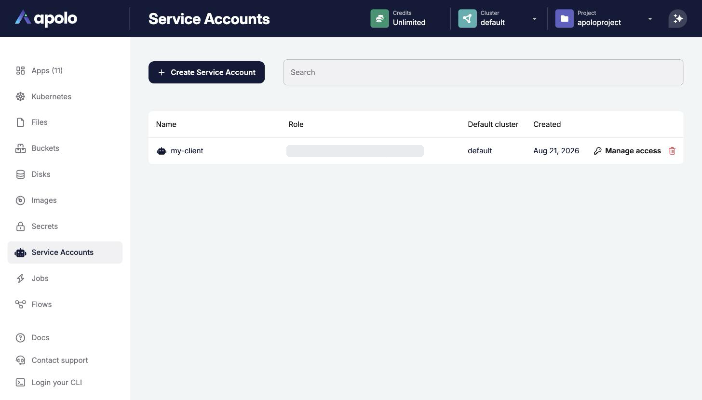
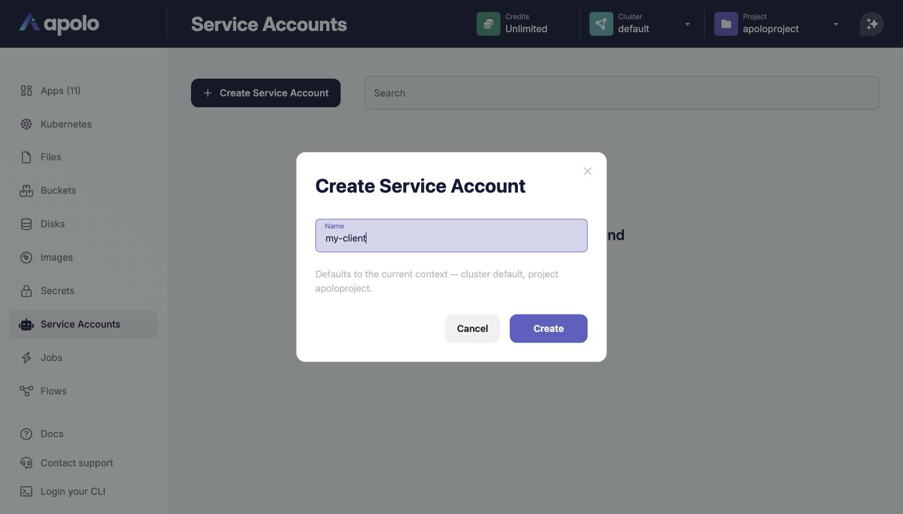
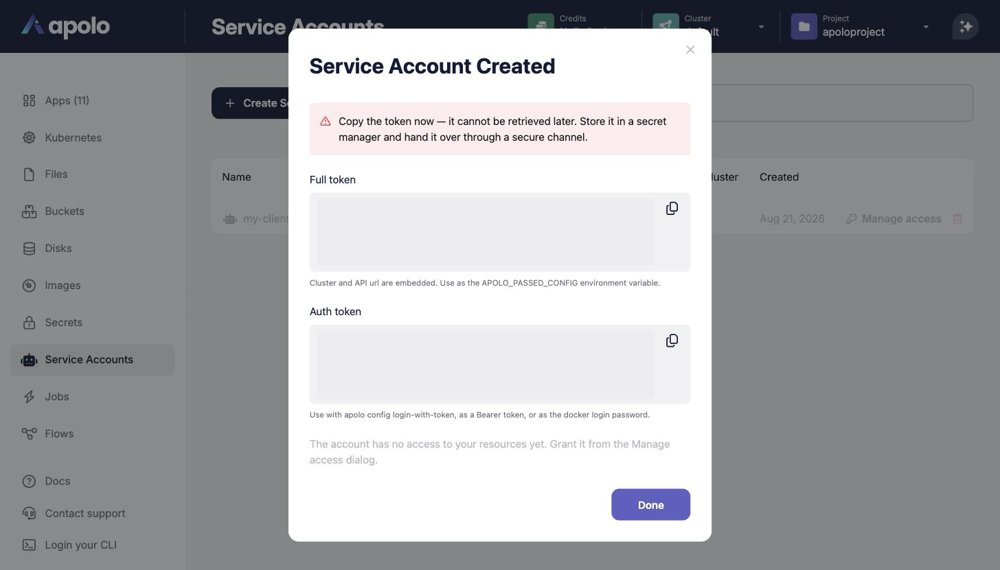
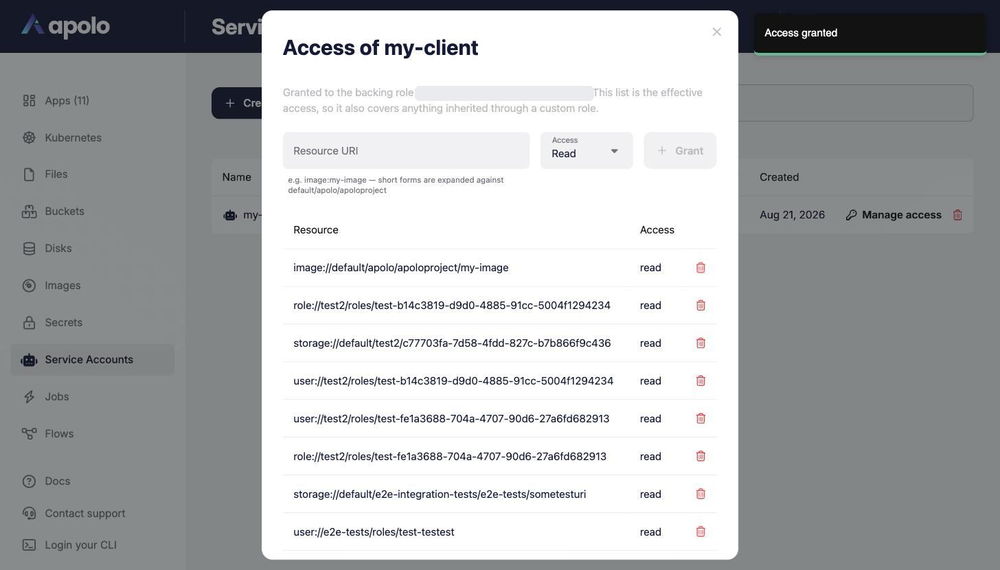

# Service Accounts

## Overview

The Service Accounts app in the Apolo Console manages non-human identities that belong to your Apolo user. A service account is meant for cases where a token, rather than a person, needs to talk to the platform — CI/CD pipelines, third-party integrations and API clients, or collaborators outside of your organization who need access to a specific set of your resources.

Every service account is backed by a **role** of the form `<owner>/service-accounts/<name>`. That role is the principal you grant permissions to — a freshly created account has no access to your resources until you grant it some.

The app, accessible from the left-hand navigation menu, lists your service accounts with their backing role, default cluster and creation date:

## Creating a service account

Click **Create Service Account** and pick a name. The default cluster, organization and project are taken from your current context:

The account's token is displayed **once**, in two forms, each with a copy control:

* **Full token** — has the cluster and API URL embedded. Use it as the `APOLO_PASSED_CONFIG` environment variable; it works from a machine with no Apolo login at all.
* **Auth token** — a bare token. Use it with `apolo config login-with-token`, as a `Bearer` token against the platform API, or as the password for `docker login` to the cluster registry.


The token cannot be retrieved later — store it in a secret manager and hand it over through a secure channel. There is no regenerate operation: rotation means deleting the account and creating a new one, then granting access again.


## Managing access

**Manage access** opens the account's permission list. It shows the *effective* access of the backing role — including anything inherited through a custom role, which makes it a convenient place to audit what a client can actually reach.

To grant access, enter a resource URI, pick a level — `Read`, `Write` or `Manage` — and click **Grant**. Short URI forms are expanded against your current context, so `image:my-image` becomes the full URI of that image in your current cluster, organization and project:

Only direct grants can be revoked from this list. An entry inherited through a custom role has to be revoked on that role.

## Deleting a service account

Deleting a service account stops its token from working immediately and removes its access grants with it. Recreating an account with the same name does not restore any previous access.

## References

* [Apolo CLI: Service Accounts](../../../apolo-concepts-cli/apps/pre-installed-apps/service-accounts/README.md)
* [Sharing access with external clients](../../../apolo-concepts-cli/apps/pre-installed-apps/service-accounts/sharing-access-with-external-clients.md)
