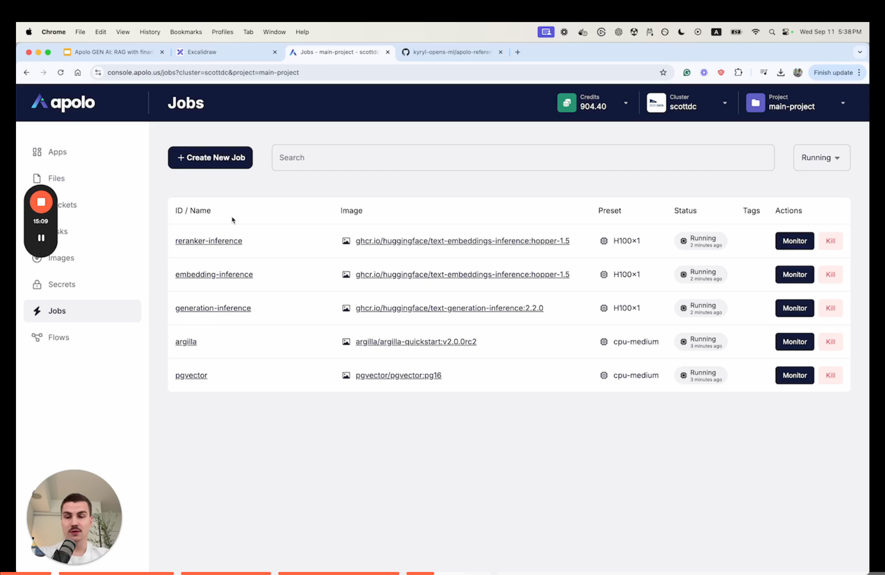
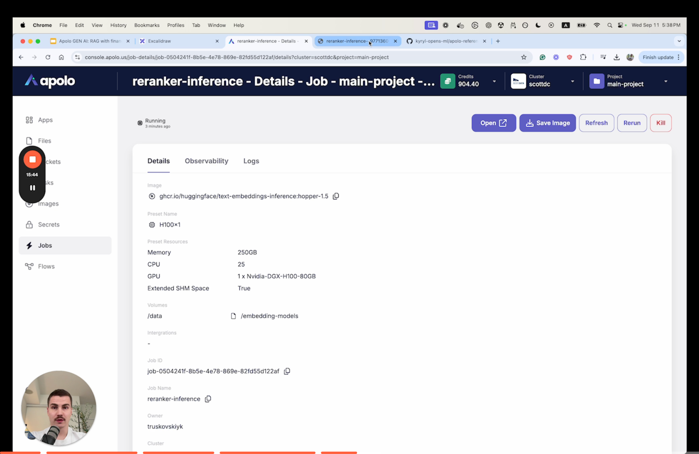

# Enterprise-Ready Generative AI Applications





Generative AI has transformed the way enterprises interact with data, but creating enterprise - grade applications demands exceptional **security** and **performance**. In this blog, we explore how to build **Retrieval-Augmented Generation (RAG)** applications using the Apolo **platform**, leveraging its on-premise capabilities and industry-leading tools.

Whether you're querying financial data or building a chatbot for enterprise documentation, Apolo streamlines the process, allowing developers to focus on innovation.

### **Enterprise-Ready: What Does It Mean?** 

Enterprise-ready solutions prioritize:

1. **Security**: Complete data privacy - nothing leaves your environment, ensuring full control.
2. **Performance**: Comparable with leading AI models like OpenAI, Anthropic, and Meta models.

Apolo’s platform combines these pillars with the flexibility to run **Llama 3.1 models** (ranging from 8B to 70B parameters), making it an ideal choice for building scalable, secure, and high-performing generative AI applications.

### **Understanding RAG and the Apolo Platform** 

Retrieval-Augmented Generation (RAG) enhances the quality of generative AI applications by combining powerful LLMs with structured retrieval systems. Here’s how it works:

1. **Generative LLM**: Generates responses by interpreting input text.
2. **Embedding LLM**: Converts text into numerical embeddings for efficient similarity searches.
3. **Re-ranker LLM**: Scores and ranks retrieved data for relevance.

Additionally, RAG applications require:

* **Retrieval Database**: For efficient storage and querying of embeddings (e.g., PostgreSQL with PGVector).
* **Data Moat**: Continuous improvement through user feedback, stored and analyzed in tools like Argilla.

The Apolo platform simplifies these complexities by offering:

* **Apolo CLI**: Streamline operations via command-line management.
* **Apolo Storage**: Secure and scalable data storage.
* **Apolo Jobs**: GPU-powered infrastructure for high-performance model operations.
* **Apolo UI**: A user-friendly interface for visualizing workflows.

The two case studies - **Apolo Documentation Chatbot** and **Canada Budget Chatbot** - demonstrate the versatility and power of RAG architectures on the **Apolo platform**.&#x20;

By combining:

* Secure, on-premise infrastructure.
* High-performance generative AI models.
* Advanced retrieval mechanisms powered by PostgreSQL, vector embeddings, and LLMs.
* Feedback-driven iterative improvements with Argilla.

The Apolo platform enables the development of enterprise-ready generative AI applications.

#### **Key Takeaways** 

* **Enterprise-grade capabilities**: Apolo ensures data security and high performance, meeting the stringent demands of enterprise use cases.
* **Customizable architectures**: The modular RAG setup can be tailored for different domains, from technical documentation to financial analysis.
* **Iterative refinement**: Feedback loops drive continuous improvement, enhancing both the user experience and system accuracy.

Whether you’re building a chatbot to navigate complex corporate documentation or to provide insights from voluminous data like budgets, the Apolo platform offers a seamless path to creating scalable, efficient, and secure generative AI applications.

If you’re interested in exploring this further, feel free to contact us ([start@apolo.us](mailto:start@apolo.us)) for a demo or check out [the code on GitHub](https://github.com/neuro-inc/apolo-reference-architectures).
