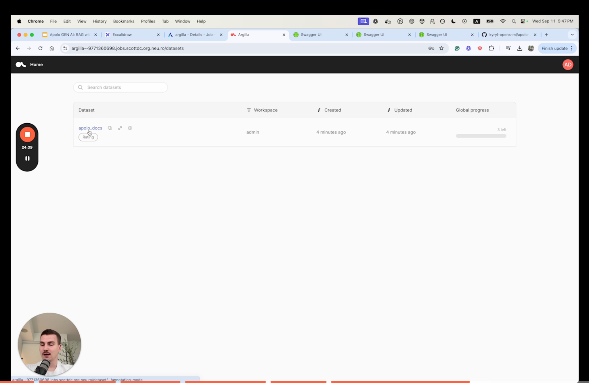

# Apolo Documentation Chatbot

The **Apolo Documentation Chatbot** enables users to query Apolo’s technical documentation seamlessly, providing quick and accurate answers. Here’s how we built it.


### **Step 1:** Set Up the Apolo RAG Architecture

The first step involves preparing the data infrastructure to support efficient querying and response generation. Here's what we'll do:

1. **Define the data storage structure**: Create a PostgreSQL schema with vector extensions to store embeddings and enable full-text indexing for fast retrieval.
2. **Chunk the documentation**: Preprocess the Apolo documentation into manageable text chunks for embeddings and efficient retrieval.
3. **Generate embeddings**: Use an embedding LLM to convert text chunks into numerical representations for semantic search.
4. **Ingest data into PostgreSQL**: Store the processed chunks and their embeddings in the database for future queries.

Here’s how we implemented this:

```python
def build_apolo_docs_rag():
    table_name = "apolo_docs"
    chunk_size = 1024
    chunk_overlap = 100

    print("1. Processing data")
    apolo_docs_path = clone_repo_to_tmp(
        repo_url="https://github.com/neuro-inc/platform-docs.git"
    )
    markdown_files = glob.glob(os.path.join(apolo_docs_path, "**/*.md"), recursive=True)
    docs = list(
        chain.from_iterable(
            [UnstructuredMarkdownLoader(f).load() for f in markdown_files]
        )
    )
    chunks = RecursiveCharacterTextSplitter(
        chunk_size=chunk_size, chunk_overlap=chunk_overlap
    ).split_documents(docs)

    print("2. Get ebeddings")
    sentences = [x.page_content for x in chunks]
    embeddings = get_embeddings(sentences=sentences)

    print("3. Ingest data")
    create_schema(table_name=table_name, dimensions=len(embeddings[0]))
    insert_data(
        table_name=table_name, embeddings=embeddings, sentences=sentences, batch_size=64
    )
```

**Breaking Down the Steps**

* **Processing Data**:\
  The `clone_repo_to_tmp()` function pulls the Apolo documentation repository, and the UnstructuredMarkdownLoader processes _`.md`_ files into raw text. The text is then chunked into overlapping segments using RecursiveCharacterTextSplitter, which ensures each chunk retains contextual relevance.
* **Generating Embeddings**:\
  To represent text chunks numerically, we use the `get_embeddings()` function. It leverages the embedding LLM hosted on Apolo’s platform to create vector representations for semantic search.

```python
def get_embeddings(sentences: List[str], batch_size: int = 4) -> List[List[float]]:
    embeddings = []
    embedding_client = get_embedding_client()
    for i in tqdm(range(0, len(sentences), batch_size)):
        sentences_batch = sentences[i : i + batch_size]
        response_batch = embedding_client.embeddings.create(
            input=sentences_batch, model="tgi"
        )
        embeddings.extend([x.embedding for x in response_batch.data])
    return embeddings
```

* **Ingesting Data**: The processed chunks and embeddings are stored in PostgreSQL. Using vector extensions (pgvector), we create a table with a schema that supports vector-based operations for semantic search.

```python
def create_schema(table_name: str, dimensions: int):
    conn = get_db_connection()

    conn.execute("CREATE EXTENSION IF NOT EXISTS vector")
    conn.execute("CREATE EXTENSION IF NOT EXISTS pg_trgm;")

    register_vector(conn)

    conn.execute(f"DROP TABLE IF EXISTS {table_name}")
    conn.execute(
        f"CREATE TABLE {table_name} (id bigserial PRIMARY KEY, content text, embedding vector({dimensions}))"
    )
    conn.execute(
        f"CREATE INDEX ON {table_name} USING GIN (to_tsvector('english', content))"
    )
```

### **Step 2: Query the Apolo Documentation**

Once the RAG architecture is set up, the next step is enabling queries. The system retrieves relevant documentation chunks, generates a response using a generative LLM, and logs the interaction for continuous improvement.

Here’s the query flow:

1. **Retrieve relevant chunks**:
   * Use **semantic search** to find embeddings closest to the query embedding.
   * Use **keyword search** for matching phrases or terms in the text.
2. **Re-rank results**: Combine results from semantic and keyword searches and sort them by relevance using a reranker model.
3. **Generate the response**: Augment the top-ranked chunks with the user query to create a context-rich prompt for the generative LLM.

<figure><figcaption></figcaption></figure>

4. **Log results**: Store the query, context, and response in Argilla for feedback and future fine-tuning.

```python
def query_apolo_docs_rag(query: str = "How to run mlflow?"):
    table_name = "apolo_docs"
    print("1. Get query embedding.")
    query_embedding = get_embeddings(sentences=[query])[0]

    print("2. Run semantic search.")
    semantic_search_result = semantic_search(
        table_name=table_name, query_embedding=query_embedding, top_n=20
    )

    print("3. Run keyword search.")
    keyword_search_result = keyword_search(table_name=table_name, query=query, top_n=20)

    print("4. Rerank results.")
    search_result = rerank(
        query=query, sentences=semantic_search_result + keyword_search_result, top_n=5
    )

    print("5. Augment & generate.")
    context = "\n".join(search_result)
    response = generate_with_context(query=query, context=context)

    console = Console()
    console.print(Panel(response, title="Generated Response", border_style="green", style="bold green"))

    print("6. Save response.")
    log_sample(
        query=query,
        context=context,
        response=response,
        dataset_name=table_name,
        keyword_search="\n".join(keyword_search_result),
        semantic_search="\n".join(semantic_search_result),
    )
```

### **Step 3:** Continuous Improvement with Argilla

<figure><figcaption></figcaption></figure>




Feedback loops are critical for improving RAG applications. Using Argilla:

* Each query, context, and response is logged for evaluation.
* Users can rate the relevance of contexts and responses, enabling targeted fine-tuning of embeddings, search algorithms, or even the LLM itself.

```python
def log_sample(
    query: str,
    context: str,
    response: str,
    semantic_search: str,
    keyword_search: str,
    dataset_name: str,
):
    client = rg.Argilla(api_url=ARGILLA_URL, api_key="admin.apikey")

    dataset = client.datasets(name=dataset_name)
    if not dataset.exists():
        settings = rg.Settings(
            fields=[
                rg.TextField(name="query"),
                rg.TextField(name="response"),
                rg.TextField(name="context"),
                rg.TextField(name="semantic_search"),
                rg.TextField(name="keyword_search"),
                
            ],
            questions=[
                rg.RatingQuestion(
                    name="context_relevance",
                    title="Relevance of the context",
                    values=[1, 2, 3, 4, 5],
                ),
                rg.RatingQuestion(
                    name="response_relevance",
                    title="Relevance of the response",
                    values=[1, 2, 3, 4, 5],
                ),
            ],
        )
        dataset = rg.Dataset(
            name=dataset_name,
            settings=settings,
            workspace="admin",
            client=client,
        )
        dataset.create()

    record = rg.Record(
        fields={
            "query": query,
            "context": context,
            "response": response,
            "semantic_search": semantic_search,
            "keyword_search": keyword_search,
        }
    )

    dataset.records.log([record])

```
