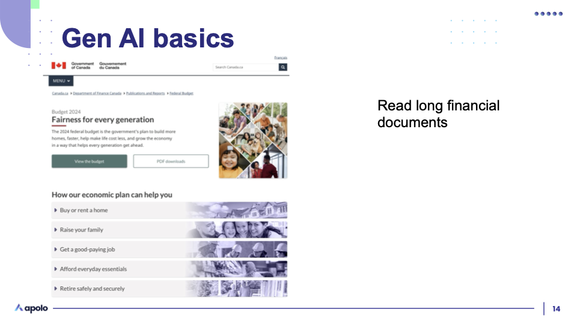
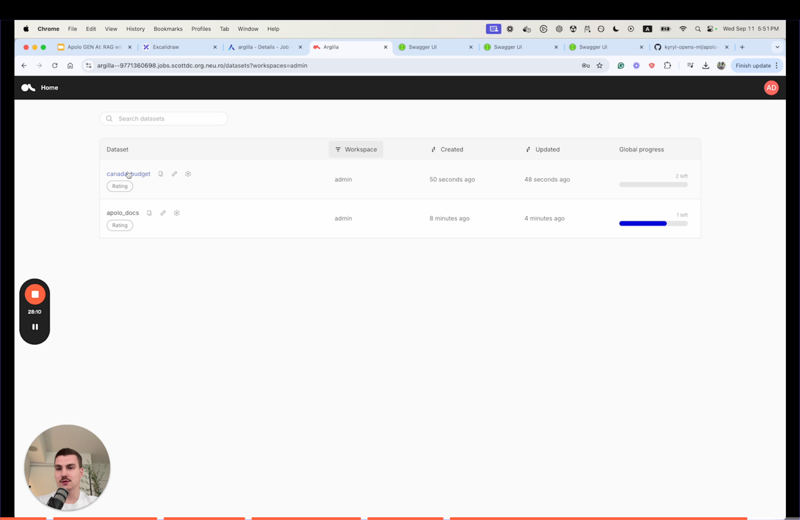
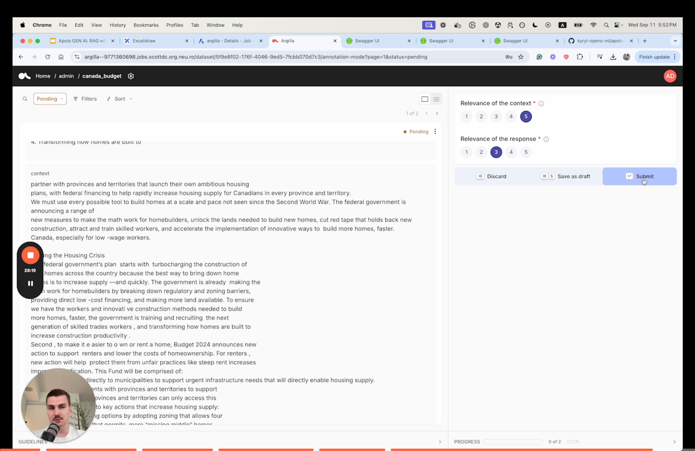

# Canada Budget RAG



**Why Build a Canada Budget Chatbot?**

The Canada Budget chatbot is a prime example of how generative AI applications can simplify complex document querying. Here's why such a system is valuable:

* **Accessibility**: Users can quickly obtain answers to specific budget-related queries without navigating lengthy documents.
* **Efficiency**: Retrieval-based search ensures responses are not only accurate but also highly relevant.
* **Customization**: By using domain-specific data (Canada Budget documents), the chatbot delivers tailored insights unavailable in generic models.

RAG isn't limited to small datasets. Here’s how Apolo processes the 500+ pages of Canada's 2024 Budget to allow for instant querying.

### **Step 1:** Set Up the Canada Budget RAG Architecture

Similar to the Apolo Documentation chatbot, this use case starts by preparing the data pipeline for effective querying. The process includes:

1. **Defining the data storage structure**: Create a PostgreSQL schema optimized for storing and retrieving text embeddings.
2. **Processing the Canada Budget**: Extract text from PDF files and chunk them for efficient indexing.
3. **Generating embeddings**: Convert the text chunks into vector embeddings for semantic search.
4. **Ingesting data into PostgreSQL**: Store processed data and embeddings in the database for querying.

```python
def build_canada_budget_rag():
    table_name = "canada_budget"
    chunk_size = 1024
    chunk_overlap = 100
    data_path = "./data/canada/"

    pdf_files = list(Path(data_path).iterdir())

    print("1. Processing data")
    list_of_pages = [
        PyPDFLoader(pdf_files[idx]).load() for idx in range(len(pdf_files))
    ]
    docs = list(chain.from_iterable(list_of_pages))
    chunks = RecursiveCharacterTextSplitter(
        chunk_size=chunk_size, chunk_overlap=chunk_overlap
    ).split_documents(docs)

    print("2. Get ebeddings")
    sentences = [x.page_content for x in chunks]
    embeddings = get_embeddings(sentences=sentences, batch_size=32)

    print("3. Ingest data")
    create_schema(table_name=table_name, dimensions=len(embeddings[0]))
    insert_data(
        table_name=table_name, embeddings=embeddings, sentences=sentences, batch_size=64
    )
```

**Breaking Down the Steps**

* **Processing Data**:\
  Using PyPDFLoader, we extract text from budget documents in PDF format. This raw text is then chunked into overlapping segments for embeddings and retrieval. This ensures each chunk remains contextually relevant during queries.
* **Generating Embeddings**:\
  The text chunks are passed through the `get_embeddings()` function, leveraging an embedding LLM hosted on Apolo to produce semantic representations.
* **Ingesting Data**:\
  The processed data and embeddings are ingested into PostgreSQL using a custom schema. This schema supports vector-based queries for semantic search and text indexing for keyword-based search.

### **Step 2:** Query the Canada Budget Chatbot

Once the architecture is in place, the next step is to enable queries on the Canada Budget dataset. The query flow follows a similar structure to the Apolo Documentation chatbot:

1. **Retrieve relevant chunks**:
   * Perform **semantic search** to find embeddings most relevant to the query.
   * Conduct **keyword search** for exact or approximate term matches.
2. **Re-rank results**: Combine results from both search methods and rank them by relevance using a reranker model.
3. **Generate the response**: Feed the top-ranked chunks into a generative LLM along with the query for contextually accurate responses.
4. **Log results**: Store the query, context, and response in Argilla for evaluation and iterative improvement.

```python
def query_canada_budget_rag(query="What actions is the government taking to increase the new housing supply?"):
    table_name = "canada_budget"

    print("1. Get query embedding.")
    query_embedding = get_embeddings(sentences=[query])[0]

    print("2. Run semantic search.")
    semantic_search_result = semantic_search(
        table_name=table_name, query_embedding=query_embedding, top_n=20
    )
    print("3. Run keyword search.")
    keyword_search_result = keyword_search(table_name=table_name, query=query, top_n=20)

    print("4. Rerank results.")
    search_result = rerank(
        query=query, sentences=semantic_search_result + keyword_search_result, top_n=5
    )

    print("5. Augment & generate.")
    context = "\n".join([doc for doc in search_result])
    response = generate_with_context(query=query, context=context)

    console = Console()
    console.print(Panel(response, title="Generated Response", border_style="green", style="bold green"))

    print("6. Save response.")
    log_sample(
        query=query,
        context=context,
        response=response,
        dataset_name=table_name,
        keyword_search="\n".join(keyword_search_result),
        semantic_search="\n".join(semantic_search_result),
    )
```

### **Step 3:** Feedback and Iterative Improvement

Feedback plays a vital role in refining the chatbot’s performance over time. The Canada Budget chatbot also utilizes the **Argilla-powered feedback loop** described in the previous case.&#x20;

Users can:

* Rate the relevance of contexts and responses.
* Identify areas for improvement in chunking, embedding quality, or retrieval mechanisms.




