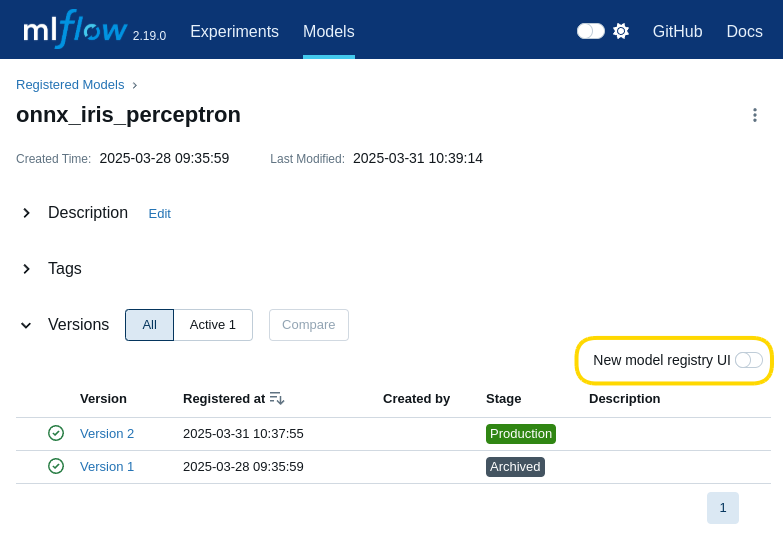

# ML Model Lifecycle using Apolo Console

This comprehensive guide will walk you through creating a complete machine learning workflow using Apolo's platform. You'll learn how to:

* Set up a Jupyter Lab environment for model development
* Train a simple classification model with scikit-learn
* Track experiments and models with MLflow
* Convert models to ONNX format for deployment
* Deploy your model as an inference service using NVIDIA Triton

### Prerequisites

* Basic familiarity with Python and machine learning concepts

### 1. Accessing the Apolo Console

1. Log in to the [Apolo](https://app.gitbook.com/o/-MMLX64i1AQdS3ehf2Kg/s/UD8kiAsnN8MKP7nzsJRQ/)
2. Verify your project selection in the top-right corner dropdown

### 2. Setting Up Your Jupyter Lab Environment

1. Navigate to the **Apps** section in the left sidebar, make sure you have the **All Apps** tab selected to view available applications
2. Locate and click on the **Jupyter Lab** card
3.  Click the **Install** button

    <figure><figcaption></figcaption></figure>
4.  Configure your Jupyter Lab instance:

    * Under **Resources**, select a preset (we'll use `cpu-small` for this tutorial)
    * Under **Metadata**, name your instance (e.g., `jupyter-lab-demo`)
    * Click **Install App**

    <figure><figcaption></figcaption></figure>
5.  Wait for the status to change from **Pending** to **Succeeded**

    <figure><figcaption></figcaption></figure>

Find more about launching Jupyter in Apolo by going to our [Jupyter Notebook page](https://app.gitbook.com/s/UD8kiAsnN8MKP7nzsJRQ/apolo-console/apps/installable-apps/available-apps/jupyter-notebook).&#x20;

### 3. Setting Up MLflow for Experiment Tracking

1. Return to the Apolo Console
2. Navigate to **Apps** > **All Apps**
3.  Find and install the **MLflow** application:

    * Select a resource preset (e.g., `cpu-small`)
    * Name your instance (e.g., `mlflow-demo`)
    * Click **Install App**

    <div><figure><figcaption></figcaption></figure> <figure><figcaption></figcaption></figure> <figure><figcaption></figcaption></figure></div>
4. Wait for the MLflow instance to reach the **Succeeded** state

### 4. Setting Up Your Development Environment

1. Return to **Apps** > **Installed Apps** and find your Jupyter Lab instance
2.  Click the **Open** button to launch Jupyter Lab in a new tab

    <figure><figcaption></figcaption></figure>
3.  Open a terminal by clicking **Terminal** under the "Other" section in the launcher

    <figure><figcaption></figcaption></figure>
4.  Navigate to the persistent storage location:

    ```bash
    cd /var/storage
    ```
5.  Clone the example repository:

    ```bash
    git clone https://github.com/neuro-inc/model-lifecycle-example
    ```

### 5. Training Your Machine Learning Model

1.  Navigate to the cloned repository through the file browser:

    * Open the `model-lifecycle-example` directory
    * Open the `notebooks` directory
    * Open `training-demo.ipynb`

    <figure><figcaption></figcaption></figure>
2. Run the notebook cells sequentially (using Shift+Enter or the Run button)

### 6. Reviewing Your Model in MLflow

1. Return to the Apolo Console
2. Navigate to **Apps** > **Installed Apps**
3. Find your MLflow instance and click **Open**
4.  Explore the experiment run:

    * Click on the most recent run
    * Review the logged parameters, metrics, and artifacts

    <figure><figcaption></figcaption></figure>
5.  Promote your ONNX model to production:

    * Click on the **Models** tab in the MLflow UI
    * Select the `onnx_iris_perceptron` model
    * Click on the latest version
    * **Important:** Ensure the **New model registry UI** toggle is turned off

    <figure><figcaption></figcaption></figure>

    * Change the **Stage** from "None" to "Production"
    * Confirm the stage transition

    <figure><figcaption></figcaption></figure>

### 7. Deploying Your Model with Apolo Deploy

1. Return to the Apolo Console
2. Navigate to **Apps** > **All Apps**
3.  Find and install **Apolo Deploy**:

    * Select a resource preset (e.g., `cpu-small`)
    * Under **Integrations**, select your MLflow instance
    * Name your deployment (e.g., `apolo-deploy-demo`)
    * Click **Install App**

    <figure><figcaption></figcaption></figure>
4. Wait for Apolo Deploy to reach the **Running** state
5.  Open Apolo Deploy and configure your model deployment:

    * Locate the `onnx_iris_perceptron` model in Production stage
    * Click the dropdown in the **Deployment** column
    * Configure the deployment:
      * Set **Server type** to `Triton`
      * Set **Create new server instance** to `True`
      * Set an optional server name (default: `triton`)
      * Select a resource preset
      * Set **Force Platform Auth** to `False` (for demo purposes only)
    * Click **Deploy**

    <div><figure><figcaption></figcaption></figure> <figure><figcaption></figcaption></figure></div>
6.  Wait for the deployment to complete

    <figure><figcaption></figcaption></figure>

### 8. Testing Your Deployed Model

1. Return to your Jupyter Lab application
2. Open the notebook called `inference-demo.ipynb`
3. Run the cells to test your deployed model

<figure><figcaption></figcaption></figure>

### Conclusion

Congratulations! You've successfully:

* Set up a Jupyter Lab environment on Apolo
* Trained a simple classification model
* Tracked your experiment and model with MLflow
* Converted your model to ONNX format
* Deployed your model using NVIDIA Triton via Apolo Deploy
* Tested your deployed model endpoint

This workflow demonstrates a complete MLOps pipeline that you can adapt for your own machine learning projects.

### Additional Resources

* [Apolo Documentation](https://docs.apolo.us/)
* [MLflow Documentation](https://www.mlflow.org/docs/latest/index.html)
* [NVIDIA Triton Inference Server](https://developer.nvidia.com/nvidia-triton-inference-server)
* [ONNX Model Format](https://onnx.ai/)
